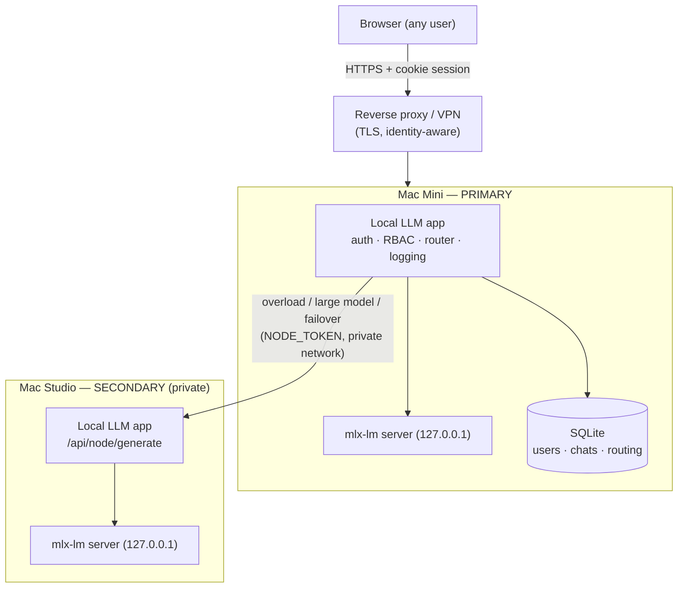

# Local LLM — self-hosted, multi-user agent for Apple Silicon

A private, self-hosted LLM assistant that runs on your own Apple Silicon Macs.
It combines a model server manager, a tool-using agent, a glass-box web chat UI,
a feedback/LoRA training loop, and a task scheduler — and now adds
**authentication and multi-user isolation**, **admin/non-admin roles**,
**Microsoft Entra ID (OIDC) login**, **structured logging with correlation IDs
and secret redaction**, **Claude conversation-history import**, and
**automatic Mac Mini → Mac Studio routing and failover**.

It stays true to its original constraint: fit big work into small RAM by
splitting it into bounded steps, slowing down rather than crashing.

## Table of contents

- [Overview](#overview)
- [Requirements](#requirements)
- [Installation](#installation)
- [Configuration](#configuration)
- [Authentication, users and roles](#authentication-users-and-roles)
- [Microsoft Entra ID / OIDC](#microsoft-entra-id--oidc)
- [Claude history import](#claude-history-import)
- [Agents, knowledge and skills](#agents-knowledge-and-skills)
- [Logging and debugging](#logging-and-debugging)
- [Automatic Mac Mini / Mac Studio routing](#automatic-mac-mini--mac-studio-routing)
- [Mac Mini deployment (primary)](#mac-mini-deployment-primary)
- [Mac Studio deployment (secondary)](#mac-studio-deployment-secondary)
- [Secure internet access](#secure-internet-access)
- [Search provider](#search-provider)
- [Testing](#testing)
- [Troubleshooting](#troubleshooting)

---

## Overview

Two processes cooperate on each machine: the Python app (web server, agent, DB,
trainer, router) and the `mlx-lm` model server it supervises. The browser talks
only to the Python app.

**Components**

- **Web server (FastAPI).** Serves the single-page UI and a JSON/SSE API. All
  routes are authenticated and role-checked server-side.
- **Auth layer.** Cookie-based sessions, scrypt password hashing, admin/non-admin
  roles, first-run admin bootstrap, an optional test user, and Entra ID / OIDC
  single sign-on. See [`local_llm/auth.py`](local_llm/auth.py).
- **Agent.** A model-as-router reasoning-and-tools loop over the local model.
- **Cluster router.** Classifies each request, picks the best node (Mac Mini
  primary / Mac Studio secondary) on live load, health and model capability, and
  fails over — no machine is ever chosen by the user. See
  [`local_llm/cluster.py`](local_llm/cluster.py).
- **SQLite database.** Conversations, feedback, memory, metrics, tasks, users,
  sessions, imports and routing telemetry — every user-owned row carries an owner
  so users are isolated. See [`local_llm/database.py`](local_llm/database.py).
- **Structured logging.** JSON logs with a correlation id per request, secret
  redaction, rotation and retention. See [`local_llm/obslog.py`](local_llm/obslog.py).
- **Claude import.** An admin uploads a Claude data-export ZIP; it is validated,
  safely extracted, parsed, de-duplicated, stored as browsable history and
  indexed for retrieval. See [`local_llm/claude_import.py`](local_llm/claude_import.py).
- **Trainer & scheduler.** LoRA fine-tuning from feedback, and named tasks the
  agent runs on demand or a timer.

**Architecture (two nodes)**



Everything works on a **single machine with auth disabled** exactly as before —
the multi-user, multi-node and auth features are additive and off by default.

---

## Requirements

- **Apple Silicon Mac(s)** (M1 or later). The backend is `mlx-lm`, Apple-Silicon
  only. Two Macs (a Mini and a Studio) for the routing/failover setup; one is fine.
- **Native arm64 Python 3.10+**. `--selftest`, `--doctor` and `--list-models`
  also run on non-Apple hardware (without the model server).
- **Dependencies** (installed automatically into `./.venv` on first run):
  `mlx-lm`, `fastapi`, `uvicorn`, `httpx`, `pydantic`. Optional:
  `python-multipart` (browser file uploads to the knowledge base),
  `PyJWT`+`cryptography` (extra OIDC signature verification), `psutil` (memory-%
  routing signal), `pytest` (test suite).
- **Network**: model downloads (Hugging Face) and the DuckDuckGo Lite search tool.
- **Microsoft**: an Entra ID app registration if you want org SSO (optional).

---

## Installation

```bash
git clone https://github.com/zeno-b/native-silicon-local-llm.git
cd native-silicon-local-llm

# 1. Configure (optional — sensible RAM-based defaults otherwise)
cp .env.example .env
# edit .env: set AUTH_ENABLED=1 and AUTH_ADMIN_PASSWORD for multi-user, etc.

# 2. Run. First launch creates ./.venv, installs deps, downloads a model, and
#    initialises the SQLite database (schema + migrations) automatically.
python3 deploy.py
```

The app prints the detected RAM, the chosen model and context window, and the URL
to open (a free port is picked if the preferred one is busy). Environment
variables from `.env` are read by your shell/process manager — either `export`
them, use `env $(cat .env | xargs)`, or a process manager that loads `.env`.

**Development mode** (single user, no login):

```bash
python3 deploy.py --agent        # auth off by default
```

**Production / multi-user mode**:

```bash
AUTH_ENABLED=1 AUTH_ADMIN_USERNAME=admin AUTH_ADMIN_PASSWORD='choose-a-strong-one' \
  python3 deploy.py
```

**Admin creation.** On first start with `AUTH_ENABLED=1`, an admin is created from
`AUTH_ADMIN_USERNAME`/`AUTH_ADMIN_PASSWORD`. If no password is set, a strong one is
generated and printed to the log **once** — save it and change it after logging in.
Re-running never resets an existing admin's password.

**Test user** (optional, for dev): set `AUTH_ALLOW_TEST_USER=1` and
`AUTH_TEST_PASSWORD=…`. It is a normal non-admin account, not a backdoor. Remove
it for production by setting `AUTH_ALLOW_TEST_USER=0` (it will not be recreated) or
deleting it from the admin **Users** panel.

**Database.** SQLite at `data/feedback.db`, created and migrated on startup. The
migration is additive and idempotent: existing single-user data is backfilled to a
`local` owner, so upgrading in place keeps every conversation.

---

## Configuration

All configuration is centralized in [`local_llm/config.py`](local_llm/config.py)
and driven by environment variables; [`.env.example`](.env.example) documents
every variable with placeholders. Highlights:

| Group | Variables |
|-------|-----------|
| Model/core | `MODEL_ID`, `CONTEXT_SIZE`, `MAX_TOKENS`, `TEMPERATURE`, `HISTORY_TURNS`, `WEB_PORT`, `MODEL_PORT` |
| Logging | `LOG_LEVEL`, `LOG_FORMAT`, `LOG_DIR`, `LOG_CHAT_CONTENT`, `LOG_MAX_BYTES`, `LOG_BACKUP_COUNT`, `LOG_RETENTION_DAYS` |
| Auth | `AUTH_ENABLED`, `AUTH_ADMIN_USERNAME`, `AUTH_ADMIN_PASSWORD`, `AUTH_SESSION_TTL_HOURS`, `AUTH_COOKIE_SECURE`, `AUTH_ALLOW_TEST_USER`, `AUTH_TEST_USERNAME`, `AUTH_TEST_PASSWORD` |
| Entra/OIDC | `OIDC_ENABLED`, `OIDC_TENANT_ID`, `OIDC_CLIENT_ID`, `OIDC_CLIENT_SECRET`, `OIDC_REDIRECT_URI`, `OIDC_ADMIN_EMAILS`, `OIDC_ADMIN_GROUPS`, `OIDC_ADMIN_ROLES`, `OIDC_DEFAULT_ROLE` |
| Cluster/routing | `NODE_ROLE`, `NODE_NAME`, `STUDIO_NODE_URL`, `PRIMARY_NODE_URL`, `NODE_TOKEN`, `ROUTE_MAX_ACTIVE`, `ROUTE_QUEUE_DEPTH`, `ROUTE_CPU_PCT`, `ROUTE_MEM_PCT`, `ROUTE_SLA_MS`, `LARGE_MODEL_MARKERS`, `HEARTBEAT_INTERVAL`, `HEARTBEAT_TIMEOUT` |
| Import | `IMPORT_MAX_ZIP_BYTES`, `IMPORT_MAX_FILES`, `IMPORT_MAX_UNCOMPRESSED_BYTES`, `IMPORT_MAX_FILE_BYTES` |
| Search | `SEARCH_RESULTS` (provider is locked to DuckDuckGo Lite) |
| Networking | `ALLOWED_ORIGINS` (extra CORS origins behind a proxy) |

Secrets (`AUTH_ADMIN_PASSWORD`, `OIDC_CLIENT_SECRET`, `NODE_TOKEN`,
`AUTH_TEST_PASSWORD`) are never returned by the API or written to logs — the
config endpoint reports only whether each is set.

Admins can change most safe settings live from **Settings** (or `POST /api/config`)
without a restart, including `LOG_LEVEL`, `LOG_CHAT_CONTENT` and the routing
thresholds. Secrets and `AUTH_ENABLED` require a restart.

---

## Authentication, users and roles

- **Sessions are cookies.** Login sets an HttpOnly, SameSite=Lax cookie holding an
  opaque token; only its SHA-256 is stored, so a database leak yields no usable
  tokens. Cookies ride along with fetch, live SSE streams and file downloads
  alike. Set `AUTH_COOKIE_SECURE=1` when served over HTTPS.
- **API clients** may authenticate with `Authorization: Bearer <token>` instead.
- **Passwords** are hashed with `hashlib.scrypt` (memory-hard, standard library).
- **Roles.**
  - *Admin* sees everything: Settings, model/routing config, system status,
    telemetry, logs, user administration, Claude import, advanced agent functions,
    system management.
  - *Non-admin* sees a simplified UI: Chat, their own conversations, available
    agents, and normal user features. They cannot reach system settings, infra
    config, detailed telemetry, debug logs, admin functions or internal routing
    controls.
- **RBAC is enforced server-side** on every route (FastAPI dependencies), not just
  hidden in the UI. Direct API requests to admin endpoints from a non-admin return
  `403`; unauthenticated requests return `401`.
- **User administration.** Admins manage accounts in the **Users** panel or via
  `GET/POST /api/users`, `POST /api/users/{id}` (role/disable/reset password),
  `DELETE /api/users/{id}`. The last admin cannot be demoted, disabled or deleted.
  A role change, disable or password reset invalidates that user's sessions.
- **Data isolation.** Conversations, memory notes, imported history, feedback,
  and per-user knowledge are scoped to their owner; one user can never read
  another's data by guessing an id. Verified by the test suite (including a
  concurrency test).

---

## Microsoft Entra ID / OIDC

Standard OpenID Connect authorization-code flow. The ID token is fetched directly
from the tenant's token endpoint over TLS (confidential client), so its claims are
trusted per the OIDC spec; if `PyJWT`+`cryptography` are installed, the signature
is additionally verified against the tenant JWKS.

**1. Register an app in Entra ID (Azure portal → App registrations):**

- Redirect URI (Web): `https://YOUR-DOMAIN/api/auth/oidc/callback`
- Create a client secret (Certificates & secrets).
- Note the **Application (client) ID** and **Directory (tenant) ID**.
- To grant admin by group, add a **groups** claim (Token configuration) or, for
  large orgs, define an **App role** (e.g. `Admin`) and assign it — app roles are
  the recommended, overage-proof mechanism.

**2. Configure the app:**

```bash
OIDC_ENABLED=1
OIDC_TENANT_ID=<tenant-guid>
OIDC_CLIENT_ID=<client-guid>
OIDC_CLIENT_SECRET=<secret>
OIDC_REDIRECT_URI=https://YOUR-DOMAIN/api/auth/oidc/callback
OIDC_ADMIN_ROLES=Admin           # or OIDC_ADMIN_EMAILS / OIDC_ADMIN_GROUPS
OIDC_DEFAULT_ROLE=user
```

**3. Use it.** The login screen shows **Sign in with Microsoft** when OIDC is
configured. On first login a local user record is created and linked to the Entra
subject; role is (re)mapped from the token on every login (the IdP is the source
of truth). Local admin login still works alongside SSO, so you are never locked
out if the IdP is unavailable. Logout clears the local session (it does not
perform a full Entra single-logout).

Local development does not require Entra — leave `OIDC_ENABLED=0` and use local
login.

---

## Claude history import

Admins can import a Claude data export (the ZIP from Claude's *Export data*
feature: a README, `conversations.json`, `projects.json`, `users.json` and any
supporting files).

**UI:** **Models** (admin) view → **Import Claude history** panel. Choose the
`.zip`, click **Import**, and watch live status/progress/counts. Failed imports
can be retried; imports can be removed (which also deletes the conversations and
knowledge they created).

**Pipeline:** upload → validate → safe extraction → discover/classify files →
parse Claude format → normalize → de-duplicate → store & index. It runs in the
background; status is tracked in the `imports` table and shown in the UI.

**Security (the ZIP is untrusted):** enforced size cap on the upload, per-file and
total-uncompressed caps and a compression-ratio guard (zip-bomb defence), entry
count limit, symlink rejection, and path-traversal / zip-slip rejection (every
entry is resolved and confirmed to stay inside the per-import staging directory).
Limits are configurable (`IMPORT_MAX_*`).

**What gets imported, and how it is used (retrieval, not prompt-stuffing):**

- **Historical conversations** → stored as real conversations you can browse and
  reopen in **History** (titled `[imported] …`, owned by you).
- **Reusable knowledge / historical context** → each conversation and project
  document is indexed into your knowledge base. The existing BM25 retrieval then
  surfaces only the passages relevant to a new question, with citations — history
  is **never** dumped wholesale into a prompt.
- **Reusable skills / instructions** → project instructions become saved prompts.
- **Inferred preferences** → explicit preferences become durable memory notes.
- **Files / artifacts** → text artifacts are indexed into the knowledge base.

**Privacy scope:** imported data is private to the importing user (owner-scoped),
retrievable only in that user's chats.

**Removal:** the **Remove** button (or `DELETE /api/imports/{id}`) deletes the
import record, its imported conversations and its knowledge-base documents.

**Troubleshooting:** if an import shows *failed*, open its row for the reason
(e.g. "path traversal blocked", "exceeds the uncompressed limit"). Oversized
uploads are rejected before processing; raise `IMPORT_MAX_*` if a legitimate
export is larger than the defaults.

---

## Agents, knowledge and skills

The agent is a model-as-router loop: cheap deterministic shortcuts (a bare URL →
fetch, arithmetic → calculator) run first, then the model returns a structured
routing decision that generic code executes. Adding a capability means registering
a tool, not writing routing rules.

- **Knowledge base (RAG).** Indexed documents are searched on every question
  (SQLite FTS5 / BM25 — no embedding model, no extra memory), and the best
  passages are prepended with their source path. Retrieval is scoped to the acting
  user's own documents plus shared ones. Admins manage the shared knowledge base
  (index files/URLs, upload, clear, scope) in the **Models** view.
- **Skills / prompts.** A prompt library (Prompts) and, from imports, saved
  project instructions.
- **Memory.** The `remember`/`recall`/`forget` tools store durable notes,
  isolated per user.
- **Tasks.** Named jobs (admin) the agent runs on demand or a timer; runs stream
  the same event types as chat.

---

## Logging and debugging

Structured, aggregation-ready logging lives in
[`local_llm/obslog.py`](local_llm/obslog.py).

- **Format & storage.** JSON (default) or text; written to `logs/app.log` with
  size-based rotation (`LOG_MAX_BYTES` × `LOG_BACKUP_COUNT`) and startup pruning of
  rotations older than `LOG_RETENTION_DAYS`. The raw mlx server output stays in
  `logs/model_server.log`.
- **Correlation IDs.** Every request is tagged with a correlation id (returned as
  the `X-Correlation-ID` response header and included in 500 bodies). Filter a
  whole request's lifecycle across chat, tool, model and routing logs by that id:

  ```bash
  grep '"correlation_id":"<id>"' logs/app.log
  ```

- **Domains.** Records carry an `event` and a `logger` domain
  (`request`, `chat`, `tool`, `model`, `routing`, `auth`, `import`).
- **Levels.** `ERROR` / `WARN` / `INFO` / `DEBUG` / `TRACE`. Set with `LOG_LEVEL`,
  or live from the admin **Settings** (applies immediately).
- **Chat-content logging.** `LOG_CHAT_CONTENT` = `disabled` (no content),
  `metadata` (length + fingerprint only — the production default), or `full`
  (redacted, truncated text). Change it live to `disabled` to stop content logging.
- **Secret redaction.** A redaction filter scrubs authorization headers, API keys,
  bearer/JWT tokens, passwords and cookies from log messages **and** structured
  fields; tool args/results are redacted before they are stored.
- **Routing decisions.** Every node-selection decision is logged and persisted to
  the `routing_events` table (`GET /api/routing/events`, `GET /api/cluster/nodes`)
  — see the next section.
- **Reading routing/model failures.** Model errors are labelled honestly (stall,
  dropped connection, out-of-memory, generic); failovers appear as
  `model.failover` events with the from-node and reason.

Read logs in the UI (admin **Models** → *Model server log*, or
`GET /api/logs/{model|train|tasks}`) or on disk under `logs/`.

---

## Automatic Mac Mini / Mac Studio routing

**The Mac Mini is the primary node; the Mac Studio is the secondary /
high-performance / fallback node. Users never choose a machine.** With no
`STUDIO_NODE_URL` configured the router has a single node and behaves exactly like
the original single-machine app.

**Routing pipeline** (a real scheduler, [`local_llm/cluster.py`](local_llm/cluster.py),
not `if machine == …`):

```
incoming request → classify → evaluate node load/health → check model capability
→ select node (record reason) → execute → fail over / retry on failure
```

**When the Studio is used** (any of):

- the Mini is overloaded (in-flight generations ≥ `ROUTE_MAX_ACTIVE`, CPU ≥
  `ROUTE_CPU_PCT`, memory ≥ `ROUTE_MEM_PCT`, or latency past `ROUTE_SLA_MS`),
- the request needs a **larger model** (the requested model matches
  `LARGE_MODEL_MARKERS`, e.g. a 32B) which only the high-memory Studio advertises,
- the Mini is unavailable.

Work returns to the Mini automatically once it is healthy and within capacity.
A failed Studio never breaks the Mini (it is simply skipped); a failed Mini shifts
eligible work to the Studio.

**Health monitoring.** A background heartbeat probes each node on
`HEARTBEAT_INTERVAL` and moves it between `healthy` / `degraded` / `overloaded` /
`starting` / `draining` / `unavailable`. The Mini reads its own model-server status
plus CPU/memory; it probes the Studio via the Studio's `GET /api/node/health`
(authenticated with `NODE_TOKEN`).

**No duplicated work.** Each generation carries a unique task id; failover retries
the same id on the next node, and the router refuses to double-dispatch an id that
is already in flight. Model generation itself is side-effect-free; the conversation
is committed once, after the generation returns.

**Observability (admins only).** `GET /api/cluster/nodes` shows every node's live
state, load and model; `GET /api/routing/events` shows, per decision, which
user/agent/model/machine handled it, why that machine was chosen, the load at the
time, failovers, duration and outcome. Example — debug why something ran on the
Studio:

```bash
curl -s -b cookies.txt http://127.0.0.1:8000/api/routing/events | python3 -m json.tool | head -40
# each event: {selected_node, reason, requested_model, status, attempt, duration_ms, candidates:[…live loads…]}
```

**Tuning.** All factors are environment/live-configurable (`ROUTE_*`,
`HEARTBEAT_*`, `LARGE_MODEL_MARKERS`) — there are no arbitrary fixed thresholds.

**How the Studio serves work securely.** The Mini calls the Studio app's
`POST /api/node/generate` (OpenAI-shaped, `NODE_TOKEN`-authenticated), which runs
the generation on the Studio's *local* mlx server. The Studio's model port is
never exposed to the network.

---

## Mac Mini deployment (primary)

1. Install prerequisites: native arm64 Python 3.10+, then clone the repo.
2. Create `.env` from `.env.example`. Set:
   ```bash
   NODE_ROLE=primary
   NODE_NAME=mac-mini
   AUTH_ENABLED=1
   AUTH_ADMIN_USERNAME=admin
   AUTH_ADMIN_PASSWORD='strong-password'
   NODE_TOKEN='a-long-random-shared-secret'      # same on both nodes
   STUDIO_NODE_URL=http://studio.local:8000        # the Studio's app URL (private network)
   MODEL_ID=mlx-community/Qwen2.5-Coder-7B-Instruct-4bit   # the Mini's everyday model
   ```
3. First run downloads the model and initialises the DB:
   ```bash
   python3 deploy.py
   ```
4. Health-check locally: open the printed URL, log in as admin, and check
   **Models** view → node status (or `curl -s -b cookies.txt http://127.0.0.1:8000/api/cluster/nodes`).
5. Make it the primary: it is, by `NODE_ROLE=primary`. Keep it always-on (a
   `launchd` LaunchAgent or a process manager that loads `.env`).
6. Test from another machine (via the reverse proxy / VPN, see below): log in and
   send a chat.

## Mac Studio deployment (secondary)

1. Same install steps on the Studio.
2. `.env`:
   ```bash
   NODE_ROLE=secondary
   NODE_NAME=mac-studio
   NODE_TOKEN='a-long-random-shared-secret'      # identical to the Mini's
   PRIMARY_NODE_URL=http://mini.local:8000         # informational
   MODEL_ID=mlx-community/Qwen2.5-Coder-32B-Instruct-4bit   # the big model the Mini offloads
   AUTH_ENABLED=1                                    # its own admin; users log in on the Mini
   # Do NOT set STUDIO_NODE_URL here (a secondary has no secondary).
   ```
3. Start it: `python3 deploy.py`. Confirm it loads its model.
4. Health-check from the Mini:
   ```bash
   curl -s -H "Authorization: Bearer $NODE_TOKEN" http://studio.local:8000/api/node/health
   ```
5. Configure as fallback / high-capacity: nothing more to do — the Mini's
   `STUDIO_NODE_URL` + `NODE_TOKEN` enable it. The Studio advertises the
   `large_model` / `high_memory` capabilities automatically.
6. Test failover: on the Mini, temporarily stop the Studio and send a chat (it
   stays on the Mini, no error); start the Studio and send a request for a large
   model (it routes to the Studio). Watch `GET /api/routing/events`.

**Keep the Studio private.** Bind it to the private network only (a Tailscale/VPN
interface or a LAN behind the firewall). Only the Mini needs to reach the Studio,
authenticated by `NODE_TOKEN`. Never expose the Studio (or either mlx model port)
to the public internet.

---

## Secure internet access

**Do not port-forward the app or the model ports directly.** Put an
identity-aware layer in front. Recommended architecture:

**Option A — Tailscale (simplest, private):** put both Macs on a Tailscale
tailnet. Users access the Mini over Tailscale (or via *Tailscale Funnel* for
public HTTPS). The Studio is reachable only from the Mini over the tailnet. No
public ports, automatic TLS with Funnel, device identity from Tailscale.

**Option B — Cloudflare Tunnel + Entra:** run `cloudflared` on the Mini pointing
at `http://127.0.0.1:8000`; Cloudflare terminates TLS on your domain and can add
an identity-aware Access policy in front. The origin is never publicly exposed.

**Option C — Reverse proxy (Caddy) + the app's Entra SSO:** Caddy on the Mini
provides automatic HTTPS and forwards to the app, which enforces auth (Entra):

```caddyfile
llm.example.com {
    encode zstd gzip
    reverse_proxy 127.0.0.1:8000
}
```
Then set `AUTH_ENABLED=1`, `AUTH_COOKIE_SECURE=1`,
`OIDC_REDIRECT_URI=https://llm.example.com/api/auth/oidc/callback`, and
`ALLOWED_ORIGINS=https://llm.example.com`.

**In all cases:**

- **TLS/HTTPS** terminated at the proxy/tunnel; set `AUTH_COOKIE_SECURE=1`.
- **Firewall**: allow only the proxy/tunnel inbound; block the app port (8000) and
  both model ports (8080) from the public internet.
- **Auth at the edge and in the app**: keep the app's own auth on even behind an
  identity-aware proxy (defence in depth).
- **Protect admin endpoints**: they are already `403` for non-admins; optionally
  add an Access policy restricting `/api/config`, `/api/logs`, `/api/users`,
  `/api/routing`, `/api/import` further at the proxy.
- **Mini ↔ Studio**: private network only, authenticated with `NODE_TOKEN` (a long
  random secret, rotated by changing it on both nodes and restarting).
- **Verify** external access with the browser and `curl -I https://llm.example.com`.
- **Revoke** access by disabling the user (admin **Users** panel — this also kills
  their sessions), rotating `NODE_TOKEN`, or removing the tunnel/Access policy.

---

## Search provider

Web search uses **DuckDuckGo Lite exclusively** (`https://lite.duckduckgo.com/lite/`).
This is a hard constraint, enforced in the search backend, the tool layer,
configuration (there is no variable to select another engine — `SEARCH_BACKEND` is
accepted only as a DuckDuckGo-Lite alias and anything else is ignored), and the
test suite. No Google/Bing/Brave/Tavily/SearXNG or any other provider is reachable.
Only `SEARCH_RESULTS` (count) is configurable.

---

## Testing

Two complementary suites, both runnable without a model server:

```bash
# Offline invariants (no dependencies needed): routing, calculator, chunking,
# auth hashing/sessions/RBAC, multi-user isolation, logging redaction, cluster
# routing decisions, Claude-import security, the DuckDuckGo-Lite lock, and more.
python3 deploy.py --selftest

# HTTP integration tests (auth flows, RBAC blocking, cross-user isolation,
# import, node-token gating, concurrency, backward-compatible auth-off).
python3 tests/test_app.py            # standalone runner
# or, with pytest installed:
python3 -m pip install pytest && python3 -m pytest tests/ -q
```

Other diagnostics: `python3 deploy.py --doctor` (ports), `--bench` (throughput),
`--print-config`, `--dump-prompt`, `--list-models`, `--tool-test <name>`.

---

## Troubleshooting

- **App won't start / "Refusing to serve a broken UI".** A malformed embedded UI;
  run `python3 deploy.py --selftest` for the specific problem.
- **Can't log in / locked out.** Local admin always works even if Entra is down.
  If you lost the admin password, set `AUTH_ADMIN_PASSWORD` and restart — but note
  it only creates the admin when none exists; to reset an existing one, use the
  admin Users panel from another admin, or (last resort) delete the `users`/`sessions`
  rows for that account in `data/feedback.db`.
- **Entra login fails.** Check `OIDC_REDIRECT_URI` matches the app registration
  exactly, the client secret is valid, and the callback host is HTTPS. The login
  page shows the specific (redacted) error.
- **Claude import fails.** Open the import row for the reason; raise `IMPORT_MAX_*`
  for a large legitimate export; a "traversal"/"zip bomb" message means the archive
  was rejected for safety.
- **Model unavailable / OOM.** Reduce `CONTEXT_SIZE`, `AUTO_FETCH_RESULTS` or
  `MAX_TOKENS`; the input-shrinking retries make this rare. In a cluster, an
  overloaded Mini offloads to the Studio automatically.
- **Studio unavailable.** The Mini keeps serving on its own; check
  `GET /api/cluster/nodes` and the Studio's `/api/node/health`, and confirm
  `NODE_TOKEN` matches on both nodes and the private network is reachable.
- **Routing looks wrong.** Read `GET /api/routing/events` — each event records the
  reason and the live node loads at decision time. Tune `ROUTE_*` /
  `LARGE_MODEL_MARKERS`.
- **Heartbeat failures.** A node shows `unavailable`/`degraded`: verify the URL,
  `NODE_TOKEN`, and that the Studio app is running.
- **A non-admin sees an admin control.** They should not; if a direct API call
  slips through it still returns `403`. File it as a bug — server-side RBAC is the
  gate, the UI hiding is cosmetic.
- **Disk filling with logs/caches.** Logs rotate and prune automatically; tune
  `LOG_MAX_BYTES`/`LOG_BACKUP_COUNT`/`LOG_RETENTION_DAYS`. Runtime dirs
  (`logs/`, `data/`, `adapters/`, caches) are gitignored.
- **Git tracking runtime files.** They are ignored via `.gitignore`; if something
  slipped in earlier, `git rm --cached <path>` (the file stays on disk).
```
