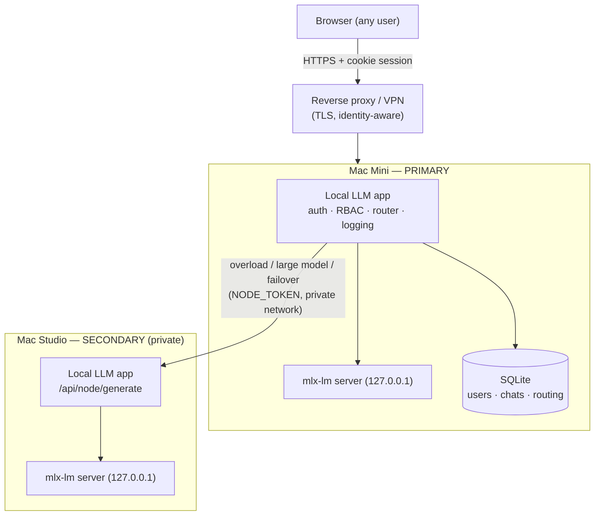

# Local LLM — self-hosted, multi-user agent for Apple Silicon

A private, self-hosted LLM assistant that runs on your own Apple Silicon Macs.
It combines a model server manager, a tool-using agent, a glass-box web chat UI,
a feedback/LoRA training loop, and a task scheduler — and adds
**authentication and multi-user isolation**, **admin/non-admin roles**,
**Microsoft Entra ID (OIDC) login**, **structured logging with correlation IDs
and secret redaction**, **conversation-history import from Claude, ChatGPT,
DeepSeek and xAI**, **named agent profiles with per-agent capabilities**
(including Office 365 over Microsoft Graph), and **automatic Mac Mini → Mac
Studio routing and failover**.

It stays true to its original constraint: fit big work into small RAM by
splitting it into bounded steps, slowing down rather than crashing.

## Table of contents

- [Overview](#overview)
- [Requirements](#requirements)
- [Installation](#installation)
- [Configuration](#configuration)
- [Authentication, users and roles](#authentication-users-and-roles)
- [Microsoft Entra ID / OIDC](#microsoft-entra-id--oidc)
- [Conversation history import](#conversation-history-import)
- [Agents, knowledge and skills](#agents-knowledge-and-skills)
- [Feedback and LoRA retraining](#feedback-and-lora-retraining)
- [Agent profiles and capabilities](#agent-profiles-and-capabilities)
- [Office 365 (Microsoft Graph)](#office-365-microsoft-graph)
- [Multi-turn task continuity](#multi-turn-task-continuity)
- [Performance and resource limits](#performance-and-resource-limits)
- [Logging and debugging](#logging-and-debugging)
- [Automatic Mac Mini / Mac Studio routing](#automatic-mac-mini--mac-studio-routing)
- [Mac Mini deployment (primary)](#mac-mini-deployment-primary)
- [Mac Studio deployment (secondary)](#mac-studio-deployment-secondary)
- [Secure internet access](#secure-internet-access)
- [Search provider](#search-provider)
- [Production hardening checklist](#production-hardening-checklist)
- [Testing](#testing)
- [Troubleshooting](#troubleshooting)

---

## Overview

Two processes cooperate on each machine: the Python app (web server, agent, DB,
trainer, router) and the `mlx-lm` model server it supervises. The browser talks
only to the Python app.

**Components**

- **Web server (FastAPI).** Serves the single-page UI and a JSON/SSE API. All
  routes are authenticated and role-checked server-side.
- **Auth layer.** Cookie-based sessions, scrypt password hashing, admin/non-admin
  roles, first-run admin bootstrap, an optional test user, and Entra ID / OIDC
  single sign-on. See [`local_llm/auth.py`](local_llm/auth.py).
- **Agent.** A model-as-router reasoning-and-tools loop over the local model.
- **Cluster router.** Classifies each request, picks the best node (Mac Mini
  primary / Mac Studio secondary) on live load, health and model capability, and
  fails over — no machine is ever chosen by the user. See
  [`local_llm/cluster.py`](local_llm/cluster.py).
- **SQLite database.** Conversations, feedback, memory, metrics, tasks, users,
  sessions, imports and routing telemetry — every user-owned row carries an owner
  so users are isolated. See [`local_llm/database.py`](local_llm/database.py).
- **Structured logging.** JSON logs with a correlation id per request, secret
  redaction, rotation and retention. See [`local_llm/obslog.py`](local_llm/obslog.py).
- **History import.** An admin uploads a chat-export ZIP from Claude, ChatGPT,
  DeepSeek or xAI; it is validated, safely extracted, parsed, de-duplicated,
  stored as browsable history and indexed for retrieval. See
  [`local_llm/claude_import.py`](local_llm/claude_import.py).
- **Agent profiles.** Named agents, each with an explicit capability set that
  becomes a concrete tool allowlist; several can answer one prompt in parallel
  and have their answers merged.
- **Trainer & scheduler.** LoRA fine-tuning from feedback, and named tasks the
  agent runs on demand or a timer.
- **Web UI.** One embedded single-page app (no build step, no bundler) in the
  `local_llm/ui_*.py` modules, assembled once at import. Every option lives under
  **Settings**, grouped into collapsible sections (Appearance, Generation, Agent,
  Models & training, Performance, Memory, Tools); admin-only panels are split into
  sub-tabs so the screen stays uncrowded. Light and dark themes are both first
  class.

**Architecture (two nodes)**



Everything works on a **single machine with auth disabled** exactly as before —
the multi-user, multi-node and auth features are additive and off by default.

---

## Requirements

- **Apple Silicon Mac(s)** (M1 or later). The backend is `mlx-lm`, Apple-Silicon
  only. Two Macs (a Mini and a Studio) for the routing/failover setup; one is fine.
- **Native arm64 Python 3.10+**. `--selftest`, `--doctor` and `--list-models`
  also run on non-Apple hardware (without the model server).
- **Dependencies** (installed automatically into `./.venv` on first run):
  `mlx-lm`, `fastapi`, `uvicorn`, `httpx`, `pydantic`. Optional:
  `python-multipart` (browser file uploads to the knowledge base),
  `PyJWT`+`cryptography` (extra OIDC signature verification), `psutil` (memory-%
  routing signal), `pytest` (test suite).
- **Network**: model downloads (Hugging Face) and the DuckDuckGo Lite search tool.
  The UI also requests its heading font from Google Fonts; if that is blocked the
  page falls back to the system font stack and everything else works unchanged.
- **Microsoft**: an Entra ID app registration if you want org SSO (optional).

---

## Installation

```bash
git clone https://github.com/zeno-b/native-silicon-local-llm.git
cd native-silicon-local-llm

# 1. Configure (optional — sensible RAM-based defaults otherwise)
cp .env.example .env
# edit .env: set AUTH_ENABLED=1 and AUTH_ADMIN_PASSWORD for multi-user, etc.

# 2. Run. First launch creates ./.venv, installs deps, downloads a model, and
#    initialises the SQLite database (schema + migrations) automatically.
python3 deploy.py
```

The app prints the detected RAM, the chosen model and context window, and the URL
to open (a free port is picked if the preferred one is busy). Environment
variables from `.env` are read by your shell/process manager — either `export`
them, use `env $(cat .env | xargs)`, or a process manager that loads `.env`.

**Development mode** (single user, no login):

```bash
python3 deploy.py --agent        # auth off by default
```

**Production / multi-user mode**:

```bash
AUTH_ENABLED=1 AUTH_ADMIN_USERNAME=admin AUTH_ADMIN_PASSWORD='choose-a-strong-one' \
  python3 deploy.py
```

**Admin creation.** On first start with `AUTH_ENABLED=1`, an admin is created from
`AUTH_ADMIN_USERNAME`/`AUTH_ADMIN_PASSWORD`. If no password is set, a strong one is
generated and printed to the log **once** — save it and change it after logging in.
Re-running never resets an existing admin's password.

**Test user** (optional, for dev): set `AUTH_ALLOW_TEST_USER=1` and
`AUTH_TEST_PASSWORD=…`. It is a normal non-admin account, not a backdoor. Remove
it for production by setting `AUTH_ALLOW_TEST_USER=0` (it will not be recreated) or
deleting it from the admin **Users** panel.

**Database.** SQLite at `data/feedback.db`, created and migrated on startup. The
migration is additive and idempotent: existing single-user data is backfilled to a
`local` owner, so upgrading in place keeps every conversation.

---

## Configuration

All configuration is centralized in [`local_llm/config.py`](local_llm/config.py)
and driven by environment variables; [`.env.example`](.env.example) documents
every variable with placeholders. Highlights:

| Group | Variables |
|-------|-----------|
| Model/core | `MODEL_ID`, `CONTEXT_SIZE`, `MAX_TOKENS`, `TEMPERATURE`, `HISTORY_TURNS`, `WEB_PORT`, `MODEL_PORT` |
| Logging | `LOG_LEVEL`, `LOG_FORMAT`, `LOG_DIR`, `LOG_CHAT_CONTENT`, `LOG_MAX_BYTES`, `LOG_BACKUP_COUNT`, `LOG_RETENTION_DAYS` |
| Auth | `AUTH_ENABLED`, `AUTH_ADMIN_USERNAME`, `AUTH_ADMIN_PASSWORD`, `AUTH_SESSION_TTL_HOURS`, `AUTH_COOKIE_SECURE`, `AUTH_ALLOW_TEST_USER`, `AUTH_TEST_USERNAME`, `AUTH_TEST_PASSWORD`, `LOGIN_MAX_FAILURES`, `LOGIN_WINDOW_S` |
| Entra/OIDC | `OIDC_ENABLED`, `OIDC_TENANT_ID`, `OIDC_CLIENT_ID`, `OIDC_CLIENT_SECRET`, `OIDC_REDIRECT_URI`, `OIDC_ADMIN_EMAILS`, `OIDC_ADMIN_GROUPS`, `OIDC_ADMIN_ROLES`, `OIDC_DEFAULT_ROLE` |
| Office 365 | `O365_TENANT_ID`, `O365_CLIENT_ID`, `O365_CLIENT_SECRET`, `O365_SCOPES` |
| Cluster/routing | `NODE_ROLE`, `NODE_NAME`, `STUDIO_NODE_URL`, `NODE_TOKEN`, `ROUTE_MAX_ACTIVE`, `ROUTE_QUEUE_DEPTH`, `ROUTE_CPU_PCT`, `ROUTE_LOAD_RATIO`, `ROUTE_MEM_PCT`, `ROUTE_SLA_MS`, `ROUTE_COOLDOWN_S`, `LARGE_MODEL_MARKERS`, `HEARTBEAT_INTERVAL`, `HEARTBEAT_TIMEOUT`, `NODE_PROBE_TIMEOUT` |
| Admission control | `MAX_CONCURRENT_GENERATIONS`, `GENERATION_QUEUE_DEPTH`, `MAX_CONCURRENT_TASKS`, `AGENT_RUN_TIMEOUT` |
| Agent/tools | `AGENT_ENABLED`, `AGENT_MAX_STEPS`, `AGENT_TOOLS`, `CODE_MAX_TOKENS`, `PROJECT_DIR`, `ALLOW_SHELL`, `ALLOW_PYTHON` |
| Task continuity | `TASK_STATE_ENABLED`, `TASK_ARTIFACT_CHARS`, `DRIFT_CHECK_ENABLED`, `ARTIFACT_REPLY_HEADROOM`, `DEBUG_PROMPTS` (see [Multi-turn task continuity](#multi-turn-task-continuity)) |
| Training | `TRAIN_MIN_EXAMPLES`, `TRAIN_EPOCHS`, `TRAIN_ITERS`, `TRAIN_LR`, `TRAIN_SEQ_LEN`, `TRAIN_BATCH_SIZE`, `TRAIN_NUM_LAYERS`, `TRAIN_FINE_TUNE_TYPE`, `TRAIN_LORA_RANK`, `TRAIN_TOOL_RATIO`, `TRAIN_TOOL_QUALITY`, `TRAIN_REPLAY_RATIO`, `TRAIN_VAL_SPLIT`, `TRAIN_VAL_CHECK`, `TRAIN_TIMEOUT`, `TRAIN_MAX_BACKUPS`, `AUTO_RETRAIN_THRESHOLD` (see [Feedback and LoRA retraining](#feedback-and-lora-retraining)) |
| Import | `IMPORT_MAX_ZIP_BYTES`, `IMPORT_MAX_FILES`, `IMPORT_MAX_UNCOMPRESSED_BYTES`, `IMPORT_MAX_FILE_BYTES` |
| Search | `SEARCH_RESULTS` (provider is locked to DuckDuckGo Lite) |
| Networking | `ALLOWED_ORIGINS` (extra CORS origins behind a proxy; `*` is refused) |

Secrets (`AUTH_ADMIN_PASSWORD`, `OIDC_CLIENT_SECRET`, `O365_CLIENT_SECRET`,
`NODE_TOKEN`, `AUTH_TEST_PASSWORD`) are never returned by the API or written to
logs — the config endpoint reports only whether each is set.

Most defaults are derived from the machine's RAM rather than hard-coded, so an
8GB MacBook and a 64GB Studio each get a sensible model, context window,
reasoning budget, fetch cap and generation concurrency without configuration.
`python3 deploy.py --print-config` prints the resolved values.

Admins can change most safe settings live from **Settings** (or `POST /api/config`)
without a restart, including `LOG_LEVEL`, `LOG_CHAT_CONTENT` and the routing
thresholds. Secrets and `AUTH_ENABLED` require a restart.

---

## Authentication, users and roles

- **Sessions are cookies.** Login sets an HttpOnly, SameSite=Lax cookie holding an
  opaque token; only its SHA-256 is stored, so a database leak yields no usable
  tokens. Cookies ride along with fetch, live SSE streams and file downloads
  alike. Set `AUTH_COOKIE_SECURE=1` when served over HTTPS.
- **API clients** may authenticate with `Authorization: Bearer <token>` instead.
- **Passwords** are hashed with `hashlib.scrypt` (memory-hard, standard library).
- **Failed logins are throttled.** After `LOGIN_MAX_FAILURES` (default 8) failures
  for one client IP + username inside `LOGIN_WINDOW_S` (default 300s), the endpoint
  answers `429` with `Retry-After` and does no password verification at all; a
  separate ceiling of three times that per client IP stops a spray across many
  usernames. A successful login clears both counters, so mistyping and then
  getting it right never locks anyone out. Because scrypt is deliberately slow,
  this protects CPU and memory as much as it protects credentials.
- **Roles.**
  - *Admin* sees everything: Settings, model/routing config, system status,
    telemetry, logs, user administration, Claude import, advanced agent functions,
    system management.
  - *Non-admin* sees a simplified UI: Chat, their own conversations, available
    agents, and normal user features. They cannot reach system settings, infra
    config, detailed telemetry, debug logs, admin functions or internal routing
    controls.
- **RBAC is enforced server-side** on every route (FastAPI dependencies), not just
  hidden in the UI. Direct API requests to admin endpoints from a non-admin return
  `403`; unauthenticated requests return `401`.
- **User administration.** Admins manage accounts in the **Users** panel or via
  `GET/POST /api/users`, `POST /api/users/{id}` (role/disable/reset password),
  `DELETE /api/users/{id}`. The last admin cannot be demoted, disabled or deleted.
  A role change, disable or password reset invalidates that user's sessions.
- **Data isolation.** Conversations, memory notes, imported history, feedback,
  and per-user knowledge are scoped to their owner; one user can never read
  another's data by guessing an id. Verified by the test suite (including a
  concurrency test).

---

## Microsoft Entra ID / OIDC

Standard OpenID Connect authorization-code flow. The ID token is fetched directly
from the tenant's token endpoint over TLS (confidential client), so its claims are
trusted per the OIDC spec; if `PyJWT`+`cryptography` are installed, the signature
is additionally verified against the tenant JWKS.

**1. Register an app in Entra ID (Azure portal → App registrations):**

- Redirect URI (Web): `https://YOUR-DOMAIN/api/auth/oidc/callback`
- Create a client secret (Certificates & secrets).
- Note the **Application (client) ID** and **Directory (tenant) ID**.
- To grant admin by group, add a **groups** claim (Token configuration) or, for
  large orgs, define an **App role** (e.g. `Admin`) and assign it — app roles are
  the recommended, overage-proof mechanism.

**2. Configure the app:**

```bash
OIDC_ENABLED=1
OIDC_TENANT_ID=<tenant-guid>
OIDC_CLIENT_ID=<client-guid>
OIDC_CLIENT_SECRET=<secret>
OIDC_REDIRECT_URI=https://YOUR-DOMAIN/api/auth/oidc/callback
OIDC_ADMIN_ROLES=Admin           # or OIDC_ADMIN_EMAILS / OIDC_ADMIN_GROUPS
OIDC_DEFAULT_ROLE=user
```

**3. Use it.** The login screen shows **Sign in with Microsoft** when OIDC is
configured. On first login a local user record is created and linked to the Entra
subject; role is (re)mapped from the token on every login (the IdP is the source
of truth). Local admin login still works alongside SSO, so you are never locked
out if the IdP is unavailable. Logout clears the local session (it does not
perform a full Entra single-logout).

Local development does not require Entra — leave `OIDC_ENABLED=0` and use local
login.

---

## Conversation history import

Admins can import a chat history export from **Claude, ChatGPT/OpenAI, DeepSeek
or xAI (Grok)** — the ZIP each of them produces from its *Export data* feature.

The parser is provider-agnostic rather than four separate importers: it accepts
the message shapes these exports actually use (a flat `messages` list, a
`chat_messages` list, or OpenAI's `mapping` conversation graph, which is
flattened by walking parent links), reads the role from whichever of `sender`,
`role` or `author.role` is present, and joins content given as a string, a list
of typed blocks, or a `{"parts": […]}` object. System and tool frames are
skipped. A new export format usually needs no code change; if it does, it is one
shape in [`local_llm/claude_import.py`](local_llm/claude_import.py).

**UI:** **Models** (admin) view → **Import chat history** panel. Choose the
`.zip`, click **Import**, and watch live status/progress/counts. Failed imports
can be retried; imports can be removed (which also deletes the conversations and
knowledge they created).

**Pipeline:** upload → validate → safe extraction → discover/classify files →
parse → normalize → de-duplicate → store & index. It runs in the background;
status is tracked in the `imports` table and shown in the UI.

**Security (the ZIP is untrusted):** enforced size cap on the upload, per-file and
total-uncompressed caps and a compression-ratio guard (zip-bomb defence), entry
count limit, symlink rejection, and path-traversal / zip-slip rejection (every
entry is resolved and confirmed to stay inside the per-import staging directory).
Limits are configurable (`IMPORT_MAX_*`).

**What gets imported, and how it is used (retrieval, not prompt-stuffing):**

- **Historical conversations** → stored as real conversations you can browse and
  reopen in **History** (titled `[imported] …`, owned by you).
- **Reusable knowledge / historical context** → each conversation and project
  document is indexed into your knowledge base. The existing BM25 retrieval then
  surfaces only the passages relevant to a new question, with citations — history
  is **never** dumped wholesale into a prompt.
- **Reusable skills / instructions** → project instructions become saved prompts.
- **Inferred preferences** → explicit preferences become durable memory notes.
- **Files / artifacts** → text artifacts are indexed into the knowledge base.

**Privacy scope:** imported data is private to the importing user (owner-scoped),
retrievable only in that user's chats.

**Removal:** the **Remove** button (or `DELETE /api/imports/{id}`) deletes the
import record, its imported conversations and its knowledge-base documents.

**Troubleshooting:** if an import shows *failed*, open its row for the reason
(e.g. "path traversal blocked", "exceeds the uncompressed limit"). Oversized
uploads are rejected before processing; raise `IMPORT_MAX_*` if a legitimate
export is larger than the defaults.

---

## Agents, knowledge and skills

The agent is a model-as-router loop: cheap deterministic shortcuts (a bare URL →
fetch, arithmetic → calculator) run first, then the model returns a structured
routing decision that generic code executes. Adding a capability means registering
a tool, not writing routing rules.

- **Knowledge base (RAG).** Indexed documents are searched on every question
  (SQLite FTS5 / BM25 — no embedding model, no extra memory), and the best
  passages are prepended with their source path. Retrieval is scoped to the acting
  user's own documents plus shared ones. Admins manage the shared knowledge base
  (index files/URLs, upload, clear, scope) in the **Models** view.
- **Skills / prompts.** A prompt library (Prompts) and, from imports, saved
  project instructions.
- **Memory.** The `remember`/`recall`/`forget` tools store durable notes,
  isolated per user.
- **Tasks.** Named jobs (admin) the agent runs on demand or a timer; runs stream
  the same event types as chat.
- **Profiles.** Named agents with explicit capability sets — see
  [Agent profiles and capabilities](#agent-profiles-and-capabilities). The agent
  on/off switch and the active profile live under **Settings → Agent**, not in
  the chat bar.

---

## Feedback and LoRA retraining

Thumbs-up, thumbs-down and corrections collect into a training corpus; **Retrain
on feedback** (or `AUTO_RETRAIN_THRESHOLD`) fine-tunes a LoRA adapter on it with
`mlx_lm.lora`, then restarts the model server on the result. A non-admin's rating
never enters the shared corpus by itself — it queues for approval first.

### The recipe is derived from the corpus, not fixed

At batch size 1 a constant iteration count means the number of *epochs* is set by
however much unrelated data happens to be in the corpus: 300 iterations is ~19
epochs over the 16-example minimum (memorisation, and a model that gets worse at
everything else) and well under one epoch once tool traces are included (rows the
optimiser never sees). Epochs are held constant instead:

```
iters = ceil(train_examples / TRAIN_BATCH_SIZE) * TRAIN_EPOCHS
        clamped to [TRAIN_MIN_ITERS, TRAIN_MAX_ITERS]
```

Set `TRAIN_ITERS` to a non-zero value to pin the count manually; `0` (the
default) derives it.

### A run has to prove itself before it is promoted

`mlx-lm` measures the first validation loss **before** any weight update, so the
first reading is that model's pre-training score on the held-out rows. With
`TRAIN_VAL_CHECK=1` (default) the run is judged against it:

- Held-out loss ended worse than it started (beyond `TRAIN_VAL_TOLERANCE`) → the
  adapter is discarded, the previous one is restored, and the feedback rows stay
  unconsumed so a later, larger run picks them up again.
- `TRAIN_PROMOTE_BEST=1` (default) promotes the best-scoring periodic checkpoint
  rather than the last one, which is early stopping after the fact and costs
  nothing — `mlx-lm` has already written the checkpoints.
- The recipe and both losses are written to `adapters/latest/training_meta.json`
  and surfaced in `GET /api/status`, so a regression is traceable to a run.

Without this the only failure the adapter backup protects against is a non-zero
exit code, and a run that converges on garbage exits 0.

### What actually goes into the corpus

| Source | Control | Notes |
|--------|---------|-------|
| Approved feedback | `TRAIN_MIN_EXAMPLES` (16) | The **only** thing the minimum-examples gate counts. Tool traces and rehearsal rows pad the corpus; they are not the signal. |
| Tool-call traces | `TRAIN_TOOL_RATIO` (3.0), `TRAIN_TOOL_QUALITY` (`rated`) | The model's own output fed back as ground truth, so it is capped at a multiple of the human rows and, by default, restricted to conversations whose answer a human approved. `error IS NULL` alone means "did not raise", not "was correct". `TRAIN_TOOL_QUALITY=all` restores the unfiltered behaviour. |
| Rehearsal / replay | `TRAIN_REPLAY_RATIO` (0.15) | The standard defence against catastrophic forgetting: this share of the *final* mixed set is drawn from `data/sft/replay.jsonl` and shuffled throughout (a block at the end is a second mini-finetune, not rehearsal). A starter set is seeded on the first run — edit it to match your own general use. |
| Held out | `TRAIN_VAL_SPLIT` (0.1) | Written to `valid.jsonl` and `test.jsonl`, never trained on. |

### Sequence length truncates the *answer*

Every example carries the full system prompt (~270 tokens as shipped), and
`mlx-lm` truncates an over-long sequence rather than dropping it — so a short
window trains the model to stop mid-answer. `TRAIN_SEQ_LEN` defaults to 1024 and
examples that still do not fit are dropped at export
(`TRAIN_DROP_OVER_LENGTH=1`) with a count in the log, rather than silently cut.
Over-length rows are *not* marked as consumed, so raising the window brings them
back. A warning fires when the system prompt has eaten more than a third of the
window.

### Operational limits

`TRAIN_TIMEOUT` (2h) kills a hung trainer, which would otherwise leave the model
server stopped indefinitely with the UI stuck on "Training LoRA adapter".
`TRAIN_MAX_BACKUPS` (5) bounds `adapters/backups/`; periodic checkpoints are
cleared after each run and excluded from backups, so neither directory grows by
one checkpoint set per retrain forever.

LoRA shape (`TRAIN_LORA_RANK`, `TRAIN_LORA_SCALE`, `TRAIN_LORA_DROPOUT`) is
passed through a generated `data/sft/lora_config.yaml`, because `mlx-lm` takes it
through a config file rather than flags. Every optional flag is probed against
`mlx_lm.lora --help` first; if that cannot be read at all the run is **refused**
rather than silently falling back to `mlx-lm`'s own defaults.

---

## Agent profiles and capabilities

A **profile** is a named agent with an explicit capability set. Capabilities are
the user-facing unit; each one expands to a concrete tool allowlist, so an agent
can only call what its capabilities grant — enforced when the agent is built, not
by prompting.

| Capability | Grants |
|------------|--------|
| `file_ops` | `read_file`, `write_file`, `edit_file`, `list_files`, `search_files`, `file_info` |
| `code_exec` | `run_shell`, `run_python`, `run_tests` (still subject to `ALLOW_SHELL` / `ALLOW_PYTHON` on the server) |
| `web_api` | `web_search`, `fetch_url` (DuckDuckGo Lite only) |
| `knowledge` | Retrieval from the acting user's indexed documents (RAG) |
| `memory` | `remember`, `recall_memory`, `forget`, `recall_feedback` |
| `office365` | `o365_mail`, `o365_files`, `o365_calendar` (see below) |

Each run gets a **copy** of the config with `agent_tools` and `rag_enabled`
narrowed to the profile, so concurrent runs with different capabilities never
clobber one another.

**Endpoints**

| Method & path | Role | Purpose |
|---------------|------|---------|
| `GET /api/agents/capabilities` | user | The capability catalogue with labels and descriptions |
| `GET /api/agents` | user | List profiles |
| `POST /api/agents` | admin | Create a profile |
| `POST /api/agents/{id}` | admin | Update a profile |
| `DELETE /api/agents/{id}` | admin | Delete a profile |
| `POST /api/agents/run` | user | Run several profiles on one prompt and merge their answers |

`/api/agents/run` fans out concurrently. Each agent is bounded by
`AGENT_RUN_TIMEOUT` (default 300s) and takes a slot from the generation gate, so
a wedged model server or a large fan-out cannot hold the request open or start an
unbounded number of generations; an agent that times out or is refused a slot
reports that as its own result and the others still return.

Non-admins can list and run profiles but not create, change or delete them.

---

## Office 365 (Microsoft Graph)

The `office365` capability adds mail, files and calendar tools backed by
Microsoft Graph. Supply an Azure AD app registration with application
permissions:

```bash
O365_TENANT_ID=<tenant-guid>
O365_CLIENT_ID=<client-guid>
O365_CLIENT_SECRET=<secret>          # never commit
O365_SCOPES=https://graph.microsoft.com/.default
```

These tools are **registered only when the credentials are configured**. Left
unset, they are absent from the tool list rather than present-and-failing: the
model never sees them, which also saves roughly 130 tokens of prefill on every
agent step. `O365_CLIENT_SECRET` is redacted everywhere, like every other secret.

---

## Multi-turn task continuity

Task identity used to live only in the transcript, and the transcript is the
thing that gets trimmed. A Bash disk-diagnostic script asked for in turn one was
the oldest message in the window, so by turn three the model saw nothing but
"add more checks and error handling" — no language, no platform, no script — and
answered with unrelated Python. [`local_llm/taskstate.py`](local_llm/taskstate.py)
makes the task an explicit object instead:

    conversation history -> TaskState -> current artifact -> relevant context -> LLM

- **The active task is structured state.** Task type, language, platform, the
  original objective, the accumulated requirements, the user's corrections, the
  current artifact with a version and a complete/truncated flag, and the latest
  request. It is rebuilt deterministically from the conversation on every turn
  (regex and signature matching, no extra model call) and persisted per
  conversation in `conversation_task_state`, so it also survives the process,
  the history-turns limit and a fully trimmed window.
- **The artifact is state, not a message.** Every lane records the code it
  produced through one exit point, so the current script has a version rather
  than being reconstructed from old messages. The brief rides on the current
  user turn, which `trim_to_context` never drops: trimming can evict any amount
  of old conversation and still cannot remove the task or the file.
- **The prompt says what the task is.** An `ACTIVE TASK` block (type, language,
  platform, artifact name/version, objective, requirements, corrections, latest
  request, the artifact itself, and the rules for the reply) is placed
  immediately before the user's words.
- **Budgets follow the task, not the wording.** "add more checks" names no
  language and no code object, so the old heuristic gave it the 512-token chat
  budget for a request to re-emit a whole script. A follow-up on a code task now
  gets `CODE_MAX_TOKENS`, and at least the artifact's own size plus
  `ARTIFACT_REPLY_HEADROOM`, clamped so prompt + reply + margin still fits the
  window. Where the artifact cannot fit alongside its own regeneration, the
  brief omits the middle, says so, and asks for changed sections only.
- **"Continue" resumes a specific artifact.** The continuation lane states the
  contract (this is Bash, this file, this platform, the block is still open,
  do not change topic or restart) instead of leaving the model to infer the task
  from its own truncated output, keeps the original objective as the anchor, and
  can resume from the stored artifact even when the partial answer has already
  been trimmed out of the visible history.
- **Drift is caught, not shipped.** After generation, an answer whose every code
  block is a language the task is not (Python where the task is Bash, HTML where
  it is SQL) is regenerated once with a corrective prompt; a second drift asks
  the user rather than returning unrelated output. The check is deliberately
  narrow — prose, unlabelled fences and mixed replies that include the right
  language are left alone.
- **Corrections are state updates.** "stop you were asked a bash script" retargets
  the language and artifact type and is quoted back in the brief under
  `CORRECTIONS FROM THE USER`, rather than being just another message. A drifted
  answer is never adopted as the current artifact.
- **A real task switch still works.** "now forget that; write a python script"
  resets the task; "add SMART checks" does not.
- **Retrieval and skills stand down mid-task.** The knowledge-base query ORs
  every term, so "checks"/"error"/"handling" matched indexed Python documents and
  injected them into a shell-script conversation. While a code task is active
  with an artifact, the artifact is the context: retrieval and skill autoload are
  suppressed unless the message points at the project.
- **Invented commands are pushed back on.** For a code task the rules block
  states the platform and forbids inventing command-line options or output field
  names, requires defensive parsing of another command's output, and asks for a
  comment where behaviour is version-dependent. With `--allow-shell` it also
  offers a read-only verification pass. Continuity does not make output correct
  on its own; this is the safeguard, not a guarantee.

Settings: `TASK_STATE_ENABLED` (default 1), `TASK_ARTIFACT_CHARS` (8000),
`DRIFT_CHECK_ENABLED` (1), `ARTIFACT_REPLY_HEADROOM` (640), `CODE_MAX_TOKENS`
(1536). All are live-mutable from `/api/config`. `TASK_STATE_ENABLED=0` restores
the previous behaviour exactly.

---

## Performance and resource limits

The design constraint throughout is a machine with shared unified memory, where
the model, the KV cache and the web process compete for the same RAM.

- **Admission control on generations.** `MAX_CONCURRENT_GENERATIONS` (default 2
  on 8-16GB, 3 on 24-32GB, 4 on 48GB+) run at once; up to
  `GENERATION_QUEUE_DEPTH` times that may wait. Anything beyond gets an immediate
  `503` with `Retry-After` instead of a request that quietly times out minutes
  later. Every in-flight generation holds its own KV cache, so this is a memory
  limit as much as a fairness one. Chat, streaming chat and each agent in a
  fan-out all draw from the same pool.
- **One pooled HTTP client.** All generations share a single keep-alive
  connection pool to the model backend rather than opening a fresh TCP
  connection per request, which matters most on multi-step agent runs.
- **Bounded fetches.** `fetch_url` decides from the response headers what it will
  keep, then stops reading there: an unsupported content type is rejected without
  downloading a byte, HTML and JSON stop at the character cap the prompt can
  actually use, and only PDFs are allowed the full 2MB ceiling.
- **Cheap status polling.** The UI polls `/api/health` every few seconds; its
  model probe is cached, its counters are single-pass SQL, and all its SQLite work
  runs on a worker thread so it never stutters an in-flight token stream.
- **Batched history queries.** Listing conversations and searching them use joins
  and batched lookups rather than per-row queries (listing 50 conversations costs
  3 queries, not 101).
- **Context fitting, not truncation.** Oversized prompts are chunked and
  summarised in bounded steps; if trimming would empty the history entirely, an
  abbreviated tail is kept with an explicit marker rather than silently dropped.
  Replies that hit the token ceiling are labelled in the answer instead of just
  stopping mid-sentence.

---

## Logging and debugging

Structured, aggregation-ready logging lives in
[`local_llm/obslog.py`](local_llm/obslog.py).

- **Format & storage.** JSON (default) or text; written to `logs/app.log` with
  size-based rotation (`LOG_MAX_BYTES` × `LOG_BACKUP_COUNT`) and startup pruning of
  rotations older than `LOG_RETENTION_DAYS`. The raw mlx server output stays in
  `logs/model_server.log`.
- **Correlation IDs.** Every request is tagged with a correlation id (returned as
  the `X-Correlation-ID` response header and included in 500 bodies). Filter a
  whole request's lifecycle across chat, tool, model and routing logs by that id:

  ```bash
  grep '"correlation_id":"<id>"' logs/app.log
  ```

- **Domains.** Records carry an `event` and a `logger` domain
  (`request`, `chat`, `tool`, `model`, `routing`, `auth`, `import`).
- **Levels.** `ERROR` / `WARN` / `INFO` / `DEBUG` / `TRACE`. Set with `LOG_LEVEL`,
  or live from the admin **Settings** (applies immediately).
- **Chat-content logging.** `LOG_CHAT_CONTENT` = `disabled` (no content),
  `metadata` (length + fingerprint only — the production default), or `full`
  (redacted, truncated text). Change it live to `disabled` to stop content logging.
- **Secret redaction.** A redaction filter scrubs authorization headers, API keys,
  bearer/JWT tokens, passwords and cookies from log messages **and** structured
  fields; tool args/results are redacted before they are stored. Token shapes are
  matched before key/value pairs, so `Authorization: Bearer <token>` loses the
  token and not just the word "Bearer".
- **Prompt tracing.** `DEBUG_PROMPTS=1` adds a `prompt.assembled` DEBUG event for
  every model call: the lane (tools / prose / continuation / drift-retry / forced),
  the task summary, the artifact version, the generation id, the requested and
  effective reply budgets, the temperature, how much history was trimmed, and the
  prompt itself. The prompt text still obeys `LOG_CHAT_CONTENT`, so it is a
  fingerprint at the `metadata` default and redacted text only at `full` — turning
  tracing on never starts writing conversation text on its own. Paired with
  `turn.start` and `router.decision` (same domain, `agent`), this is what makes the
  semantic context the model received visible, rather than only token counts.
- **Routing decisions.** Every node-selection decision is logged and persisted to
  the `routing_events` table (`GET /api/routing/events`, `GET /api/cluster/nodes`)
  — see the next section.
- **Reading routing/model failures.** Model errors are labelled honestly (stall,
  dropped connection, out-of-memory, generic); failovers appear as
  `model.failover` events with the from-node and reason.

Read logs in the UI (admin **Models** → *Model server log*, or
`GET /api/logs/{model|train|tasks}`) or on disk under `logs/`.

---

## Automatic Mac Mini / Mac Studio routing

**The Mac Mini is the primary node; the Mac Studio is the secondary /
high-performance / fallback node. Users never choose a machine.** With no
`STUDIO_NODE_URL` configured the router has a single node and behaves exactly like
the original single-machine app.

**Routing pipeline** (a real scheduler, [`local_llm/cluster.py`](local_llm/cluster.py),
not `if machine == …`):

```
incoming request → classify → evaluate node load/health → check model capability
→ select node (record reason) → execute → fail over / retry on failure
```

**When the Studio is used** (any of):

- the Mini is overloaded (in-flight generations ≥ `ROUTE_MAX_ACTIVE`, CPU ≥
  `ROUTE_CPU_PCT`, memory ≥ `ROUTE_MEM_PCT`, load average **per core** ≥
  `ROUTE_LOAD_RATIO`, or latency past `ROUTE_SLA_MS`),
- the request needs a **larger model** (the requested model matches
  `LARGE_MODEL_MARKERS`, e.g. a 32B) which only the high-memory Studio advertises,
- the Mini is unavailable.

Work returns to the Mini automatically once it is healthy and within capacity.
A failed Studio never breaks the Mini (it is simply skipped); a failed Mini shifts
eligible work to the Studio.

**Health monitoring.** A background heartbeat probes each node on
`HEARTBEAT_INTERVAL` and moves it between `healthy` / `degraded` / `overloaded` /
`starting` / `draining` / `unavailable`. The Mini reads its own model-server status
plus CPU/memory; it probes the Studio via the Studio's `GET /api/node/health`
(authenticated with `NODE_TOKEN`).

Load signals are reported honestly or not at all: without `psutil` a node reports
CPU and memory as *unmeasured* rather than substituting a plausible number, and
the load average is compared per core as a ratio, never mistaken for a
percentage. A node's name and its advertised capabilities are derived from the
machine itself (`hw.model` and physical RAM), so a MacBook does not inherit the
Mini's identity or claim `high_memory` — only machines with 32GB or more
advertise `high_memory`, `large_model` and `reasoning`.

**Circuit breaker.** A node that fails is skipped for `ROUTE_COOLDOWN_S` before
one half-open trial is allowed through, so a node that is down does not cost
every request a connection timeout, and a node that recovers is picked up
without a restart.

**No duplicated work.** Each generation carries a unique task id; failover retries
the same id on the next node, and the router refuses to double-dispatch an id that
is already in flight. Model generation itself is side-effect-free; the conversation
is committed once, after the generation returns.

**Observability (admins only).** `GET /api/cluster/nodes` shows every node's live
state, load and model; `GET /api/routing/events` shows, per decision, which
user/agent/model/machine handled it, why that machine was chosen, the load at the
time, failovers, duration and outcome. Example — debug why something ran on the
Studio:

```bash
curl -s -b cookies.txt http://127.0.0.1:8000/api/routing/events | python3 -m json.tool | head -40
# each event: {selected_node, reason, requested_model, status, attempt, duration_ms, candidates:[…live loads…]}
```

**Tuning.** All factors are environment/live-configurable (`ROUTE_*`,
`HEARTBEAT_*`, `LARGE_MODEL_MARKERS`) — there are no arbitrary fixed thresholds.

**How the Studio serves work securely.** The Mini calls the Studio app's
`POST /api/node/generate` (OpenAI-shaped, `NODE_TOKEN`-authenticated), which runs
the generation on the Studio's *local* mlx server. The Studio's model port is
never exposed to the network.

---

## Mac Mini deployment (primary)

1. Install prerequisites: native arm64 Python 3.10+, then clone the repo.
2. Create `.env` from `.env.example`. Set:
   ```bash
   NODE_ROLE=primary
   NODE_NAME=mac-mini
   AUTH_ENABLED=1
   AUTH_ADMIN_USERNAME=admin
   AUTH_ADMIN_PASSWORD='strong-password'
   NODE_TOKEN='a-long-random-shared-secret'      # same on both nodes
   STUDIO_NODE_URL=http://studio.local:8000        # the Studio's app URL (private network)
   MODEL_ID=mlx-community/Qwen2.5-Coder-7B-Instruct-4bit   # the Mini's everyday model
   ```
3. First run downloads the model and initialises the DB:
   ```bash
   python3 deploy.py
   ```
4. Health-check locally: open the printed URL, log in as admin, and check
   **Models** view → node status (or `curl -s -b cookies.txt http://127.0.0.1:8000/api/cluster/nodes`).
5. Make it the primary: it is, by `NODE_ROLE=primary`. Keep it always-on (a
   `launchd` LaunchAgent or a process manager that loads `.env`).
6. Test from another machine (via the reverse proxy / VPN, see below): log in and
   send a chat.

## Mac Studio deployment (secondary)

1. Same install steps on the Studio.
2. `.env`:
   ```bash
   NODE_ROLE=secondary
   NODE_NAME=mac-studio
   NODE_TOKEN='a-long-random-shared-secret'      # identical to the Mini's
   MODEL_ID=mlx-community/Qwen2.5-Coder-32B-Instruct-4bit   # the big model the Mini offloads
   AUTH_ENABLED=1                                    # its own admin; users log in on the Mini
   # Do NOT set STUDIO_NODE_URL here (a secondary has no secondary).
   ```
3. Start it: `python3 deploy.py`. Confirm it loads its model.
4. Health-check from the Mini:
   ```bash
   curl -s -H "Authorization: Bearer $NODE_TOKEN" http://studio.local:8000/api/node/health
   ```
5. Configure as fallback / high-capacity: nothing more to do — the Mini's
   `STUDIO_NODE_URL` + `NODE_TOKEN` enable it. The Studio advertises the
   `large_model` / `high_memory` capabilities automatically.
6. Test failover: on the Mini, temporarily stop the Studio and send a chat (it
   stays on the Mini, no error); start the Studio and send a request for a large
   model (it routes to the Studio). Watch `GET /api/routing/events`.

**Keep the Studio private.** Bind it to the private network only (a Tailscale/VPN
interface or a LAN behind the firewall). Only the Mini needs to reach the Studio,
authenticated by `NODE_TOKEN`. Never expose the Studio (or either mlx model port)
to the public internet.

---

## Secure internet access

**Do not port-forward the app or the model ports directly.** Put an
identity-aware layer in front. Recommended architecture:

**Option A — Tailscale (simplest, private):** put both Macs on a Tailscale
tailnet. Users access the Mini over Tailscale (or via *Tailscale Funnel* for
public HTTPS). The Studio is reachable only from the Mini over the tailnet. No
public ports, automatic TLS with Funnel, device identity from Tailscale.

**Option B — Cloudflare Tunnel + Entra:** run `cloudflared` on the Mini pointing
at `http://127.0.0.1:8000`; Cloudflare terminates TLS on your domain and can add
an identity-aware Access policy in front. The origin is never publicly exposed.

**Option C — Reverse proxy (Caddy) + the app's Entra SSO:** Caddy on the Mini
provides automatic HTTPS and forwards to the app, which enforces auth (Entra):

```caddyfile
llm.example.com {
    encode zstd gzip
    reverse_proxy 127.0.0.1:8000
}
```
Then set `AUTH_ENABLED=1`, `AUTH_COOKIE_SECURE=1`,
`OIDC_REDIRECT_URI=https://llm.example.com/api/auth/oidc/callback`, and
`ALLOWED_ORIGINS=https://llm.example.com`.

**In all cases:**

- **TLS/HTTPS** terminated at the proxy/tunnel; set `AUTH_COOKIE_SECURE=1`.
- **Firewall**: allow only the proxy/tunnel inbound; block the app port (8000) and
  both model ports (8080) from the public internet.
- **Auth at the edge and in the app**: keep the app's own auth on even behind an
  identity-aware proxy (defence in depth).
- **Protect admin endpoints**: they are already `403` for non-admins; optionally
  add an Access policy restricting `/api/config`, `/api/logs`, `/api/users`,
  `/api/routing`, `/api/import` further at the proxy.
- **Mini ↔ Studio**: private network only, authenticated with `NODE_TOKEN` (a long
  random secret, rotated by changing it on both nodes and restarting).
- **Verify** external access with the browser and `curl -I https://llm.example.com`.
- **Revoke** access by disabling the user (admin **Users** panel — this also kills
  their sessions), rotating `NODE_TOKEN`, or removing the tunnel/Access policy.

---

## Search provider

Web search uses **DuckDuckGo Lite exclusively** (`https://lite.duckduckgo.com/lite/`).
This is a hard constraint, enforced in the search backend, the tool layer,
configuration (there is no variable to select another engine — `SEARCH_BACKEND` is
accepted only as a DuckDuckGo-Lite alias and anything else is ignored), and the
test suite. No Google/Bing/Brave/Tavily/SearXNG or any other provider is reachable.
Only `SEARCH_RESULTS` (count) is configurable.

---

## Production hardening checklist

Work through this before exposing the app to anyone but yourself. Every item is
enforced or configurable in the code, not just advice.

**Identity**

- [ ] `AUTH_ENABLED=1`. With auth off the app serves a single synthetic local
      admin to whoever reaches it; that is safe only because the server binds
      `127.0.0.1` exclusively. If you put a proxy in front, auth must be on.
- [ ] `AUTH_ADMIN_PASSWORD` set to something you chose, or the random one printed
      once at first startup changed after you log in. It is never hard-coded.
- [ ] `AUTH_ALLOW_TEST_USER=0` (the dev account is not a backdoor, but it has no
      place in production).
- [ ] `AUTH_COOKIE_SECURE=1` once TLS terminates in front of the app.
- [ ] Login throttle left on, or `LOGIN_MAX_FAILURES` / `LOGIN_WINDOW_S` tuned
      deliberately rather than by accident.
- [ ] OIDC configured if the org has an IdP; local admin login stays as the
      break-glass path.

**Network**

- [ ] The app port (8000) and both model ports (8080) are unreachable from the
      internet. The app itself only ever listens on `127.0.0.1`.
- [ ] TLS terminated by a proxy or tunnel (see
      [Secure internet access](#secure-internet-access)).
- [ ] `ALLOWED_ORIGINS` lists exact origins. `*` is **refused** at startup with a
      warning, because a wildcard combined with cookie credentials would let any
      site the user visits drive this API as them.
- [ ] `NODE_TOKEN` set to a long random secret on both nodes, and the Studio
      reachable only over the private network.

**Data**

- [ ] Back up `data/feedback.db` (it holds users, sessions, conversations,
      feedback and imports). `GET /api/backup` exports it.
- [ ] Decide the log content level: `LOG_CHAT_CONTENT=metadata` (default) logs
      lengths and fingerprints, `full` logs redacted message text, `disabled`
      logs neither. Secrets are redacted at every level.
- [ ] `LOG_RETENTION_DAYS` matches your retention policy.
- [ ] Review the training queue. A non-admin's rating never enters the shared
      LoRA corpus by itself: it waits in **Models → Training data → approve
      queued** (`POST /api/feedback/approve-pending`). Leave
      `AUTO_RETRAIN_THRESHOLD=0` unless you want retraining to fire unattended.
- [ ] Check `adapters/latest/training_meta.json` after a retrain: it records the
      recipe and the held-out loss before and after. A run that made the model
      worse is rolled back automatically (`TRAIN_VAL_CHECK=1`), but the numbers
      are what tell you whether the corpus is big enough yet.

**Capability**

- [ ] `ALLOW_SHELL` and `ALLOW_PYTHON` stay `0` unless you intend users to
      execute code on the host. The `code_exec` capability cannot bypass them.
- [ ] `PROJECT_DIR` points at the repo you actually want editable, if any. The
      diff endpoint deliberately withholds the enclosing repository.
- [ ] `MAX_CONCURRENT_GENERATIONS` sized for the machine's RAM, not optimism.
- [ ] Agent profiles grant the narrowest capability set that does the job.

**Verify**

- [ ] `python3 deploy.py --selftest` and `python3 tests/test_app.py` both pass on
      the box you are deploying to.
- [ ] `python3 deploy.py --print-config` shows the values you expect (it prints
      resolved config, never secrets).
- [ ] A non-admin account can reach Chat and nothing else — confirm with a direct
      `curl` to an admin endpoint, not just by looking at the UI.

---

## Testing

Two complementary suites, both runnable without a model server:

```bash
# 18 offline invariant checks (no dependencies needed): routing, calculator,
# chunking, auth hashing/sessions/RBAC, multi-user isolation, logging redaction,
# cluster routing decisions, import security, multi-provider import parsing,
# agent capability -> tool mapping, the DuckDuckGo-Lite lock, and the embedded
# UI's structural invariants (one <script>, one <style>, balanced markup, every
# getElementById target present, no unescaped innerHTML).
python3 deploy.py --selftest

# 45 HTTP integration and training tests (auth flows, login throttling, RBAC
# blocking, cross-user isolation, per-user prompt isolation, the derived
# training recipe, the corpus gates, val-loss rollback, the training-approval gate,
# CORS wildcard refusal, generation admission control, agent CRUD and capability
# gating, import, node-token gating, concurrency, backward-compatible auth-off).
python3 tests/test_app.py            # standalone runner
# or, with pytest installed:
python3 -m pip install pytest && python3 -m pytest tests/ -q

# The single-file build must pass the same invariants as the package.
python3 bundle.py && python3 deploy_bundled.py --selftest
```

Other diagnostics: `python3 deploy.py --doctor` (ports), `--bench` (throughput),
`--print-config`, `--dump-prompt`, `--list-models`, `--tool-test <name>`.

---

## Troubleshooting

- **App won't start / "Refusing to serve a broken UI".** A malformed embedded UI;
  run `python3 deploy.py --selftest` for the specific problem.
- **Can't log in / locked out.** Local admin always works even if Entra is down.
  If you lost the admin password, set `AUTH_ADMIN_PASSWORD` and restart — but note
  it only creates the admin when none exists; to reset an existing one, use the
  admin Users panel from another admin, or (last resort) delete the `users`/`sessions`
  rows for that account in `data/feedback.db`.
- **Entra login fails.** Check `OIDC_REDIRECT_URI` matches the app registration
  exactly, the client secret is valid, and the callback host is HTTPS. The login
  page shows the specific (redacted) error.
- **Claude import fails.** Open the import row for the reason; raise `IMPORT_MAX_*`
  for a large legitimate export; a "traversal"/"zip bomb" message means the archive
  was rejected for safety.
- **Model unavailable / OOM.** Reduce `CONTEXT_SIZE`, `AUTO_FETCH_RESULTS` or
  `MAX_TOKENS`; the input-shrinking retries make this rare. In a cluster, an
  overloaded Mini offloads to the Studio automatically.
- **Studio unavailable.** The Mini keeps serving on its own; check
  `GET /api/cluster/nodes` and the Studio's `/api/node/health`, and confirm
  `NODE_TOKEN` matches on both nodes and the private network is reachable.
- **Routing looks wrong.** Read `GET /api/routing/events` — each event records the
  reason and the live node loads at decision time. Tune `ROUTE_*` /
  `LARGE_MODEL_MARKERS`.
- **Heartbeat failures.** A node shows `unavailable`/`degraded`: verify the URL,
  `NODE_TOKEN`, and that the Studio app is running.
- **A non-admin sees an admin control.** They should not; if a direct API call
  slips through it still returns `403`. File it as a bug — server-side RBAC is the
  gate, the UI hiding is cosmetic.
- **Disk filling with logs/caches.** Logs rotate and prune automatically; tune
  `LOG_MAX_BYTES`/`LOG_BACKUP_COUNT`/`LOG_RETENTION_DAYS`. Runtime dirs
  (`logs/`, `data/`, `adapters/`, caches) are gitignored.
- **Git tracking runtime files.** They are ignored via `.gitignore`; if something
  slipped in earlier, `git rm --cached <path>` (the file stays on disk).
- **`429 too many failed attempts`.** The login throttle. Wait out the
  `Retry-After` seconds; a successful login clears the counter immediately. Raise
  `LOGIN_MAX_FAILURES` only if a legitimate shared-IP setup trips it.
- **`503 … generations already queued`.** Admission control is shedding load
  rather than running out of memory. Raise `MAX_CONCURRENT_GENERATIONS` only if
  the machine genuinely has the RAM for another concurrent KV cache; raising
  `GENERATION_QUEUE_DEPTH` instead just makes callers wait longer.
- **Thumbs-up did not reach the training data.** Expected for a non-admin: it is
  queued. An admin releases it in **Models → Training data → approve queued**.
- **Headings render in the fallback font.** Google Fonts is unreachable from that
  machine or blocked by policy. Everything else works; the page falls back to the
  system font stack by design.
```
