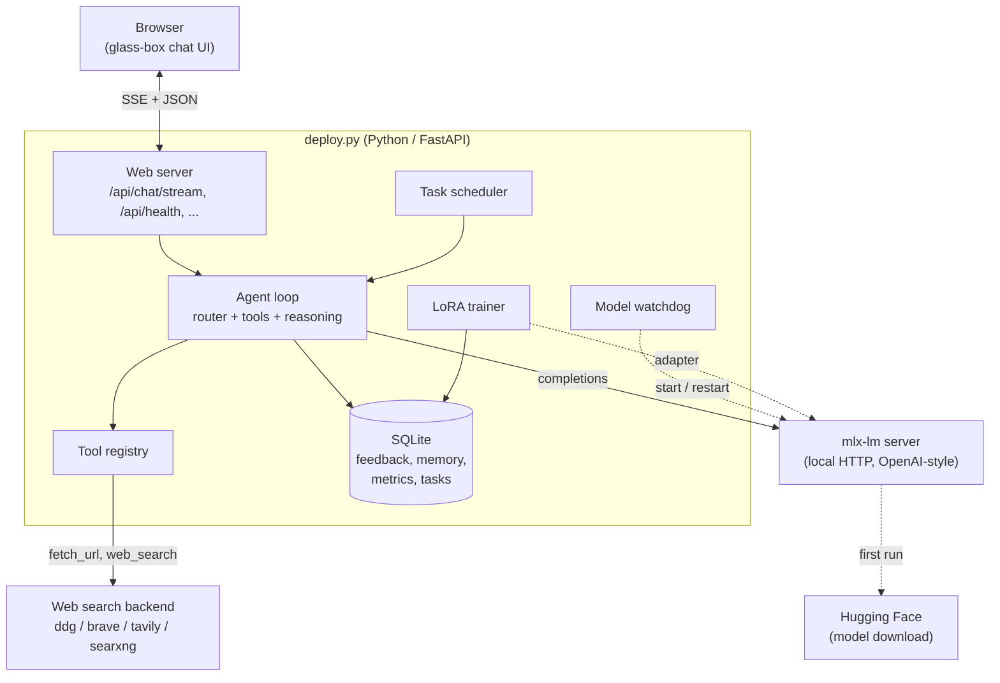
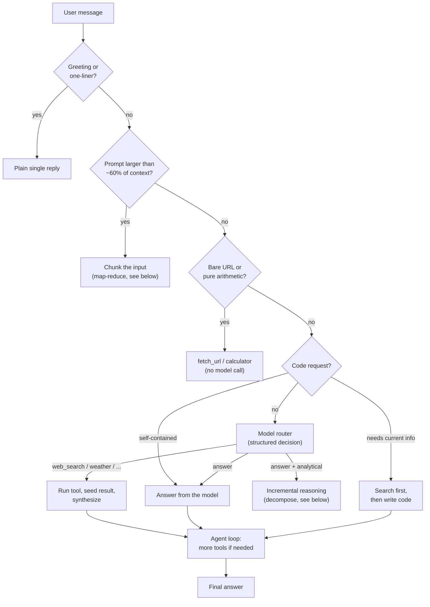
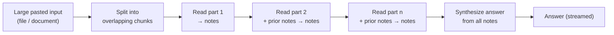
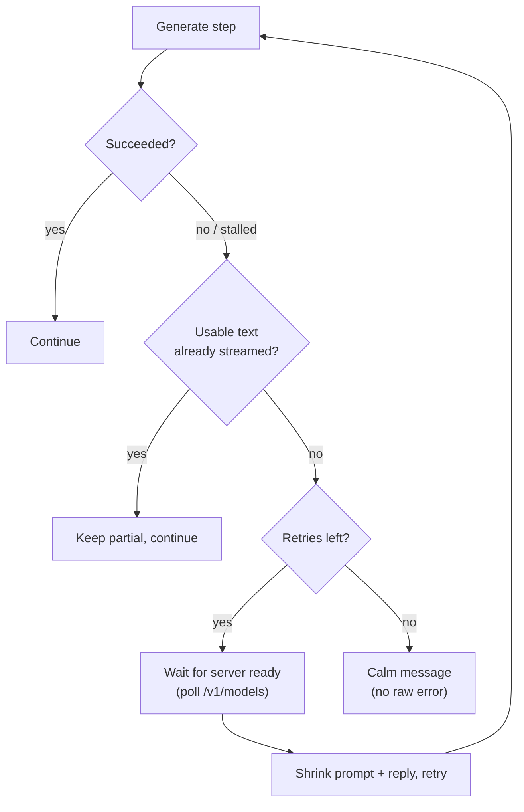
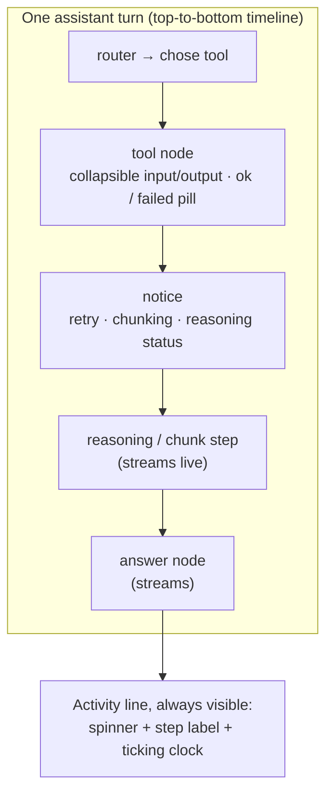
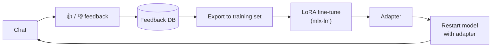

# Local LLM — self-hosted agent, trainer & feedback loop for Apple Silicon
---

## Table of contents

- [What it does](#what-it-does)
- [Requirements](#requirements)
- [Quick start](#quick-start)
- [System architecture](#system-architecture)
- [How a message is handled](#how-a-message-is-handled)
- [Fitting big work into small RAM](#fitting-big-work-into-small-ram)
- [RAM-aware auto-configuration](#ram-aware-auto-configuration)
- [Resilience: never stop, never hang](#resilience-never-stop-never-hang)
- [Tools](#tools)
- [The web UI (glass box)](#the-web-ui-glass-box)
- [Feedback and LoRA retraining](#feedback-and-lora-retraining)
- [Tasks](#tasks)
- [Branding](#branding)
- [Configuration reference](#configuration-reference)
- [Command-line reference](#command-line-reference)
- [HTTP API](#http-api)
- [Testing and diagnostics](#testing-and-diagnostics)
- [Troubleshooting](#troubleshooting)

---

## What it does

At a glance, the app combines several roles that usually live in separate tools:

- **Model server manager.** Launches and supervises an `mlx-lm` server, with a watchdog that restarts it if it dies.
- **Agent.** A reasoning-and-tools loop over the local model, driven by a model-as-router design rather than brittle keyword rules.
- **Web chat UI.** A dark, single-page interface that renders the agent's work as a live "glass box" trace.
- **Feedback store.** A SQLite database of conversations and thumbs-up/down ratings.
- **Trainer.** LoRA fine-tuning on collected feedback, with adapter management and automatic backups.
- **Scheduler.** Named tasks the agent can run on demand or on a timer.

The defining constraint is memory. On 8 GB, a large prompt or a complex task will not fit in one pass, so the app is designed to **split work into bounded steps** — it slows down rather than crashing.

---

## Requirements

- **Apple Silicon Mac** (M1 or later). The model backend is `mlx-lm`, which is Apple-Silicon only.
- **Native arm64 Python** (3.10+). A `config.json`-style model is fetched from Hugging Face on first run.
- Network access for model downloads and for the web search tool.

The app installs nothing globally; point it at a virtual environment and run the file.

---

## Quick start

```bash
# Serve the model + web UI (auto-selects a model and context size for your RAM)
python3 deploy.py

# Seed a tiny demo conversation and exit
python3 deploy.py --seed-demo

# Run in agent mode with an explicit context and reply budget
python3 deploy.py --agent --context-size 8192 --max-tokens 512

# Pin a specific model (skips RAM-based selection)
MODEL_ID="mlx-community/Qwen2.5-Coder-7B-Instruct-4bit" python3 deploy.py

# Brand it
APP_NAME="TESTLab" APP_LOGO="AI" python3 deploy.py
```

On start the app prints the detected RAM, the chosen model, and the chosen context window, then serves the UI on a free local port (printed to the log). Open that URL in a browser.

---

## System architecture

Two processes cooperate on one machine: the Python app (web server, agent, DB, trainer) and the `mlx-lm` model server it supervises. The browser talks only to the Python app.



Key components:

- **Web server (FastAPI).** Serves the UI and a JSON/SSE API. Chat streams over Server-Sent Events.
- **Model server manager + watchdog.** Owns the `mlx-lm` subprocess, probes its health, and restarts it on failure. Because the app and model share unified memory, an out-of-memory kill of the model process is treated as a transient error and recovered.
- **Agent.** The core loop described in the next section.
- **SQLite database.** Stores conversations, feedback ratings, agent memory/notes, run metrics, and task definitions. Persists across restarts.
- **Trainer.** Exports feedback to a training set and runs LoRA fine-tuning, producing an adapter the model server can load.

---

## How a message is handled

Every substantive message flows through a layered decision. Cheap, unambiguous cases are handled deterministically; everything else is routed by the model itself, which returns a **structured decision** that generic code then executes. This is what keeps routing maintainable: adding a capability means registering a tool, not writing new rules.



The router is **registry-driven**. It offers the model a menu built from whatever tools are marked routable (each contributes a one-line description), and the model replies with a single JSON object such as `{"action":"weather","location":"Brussels","when":"tomorrow"}` or `{"action":"answer"}`. Generic code validates the decision, fills defaults, and executes it. On any malformed or unusable reply it falls back safely to a web search (or a direct answer when no search tool exists), so a lookup is never silently answered from stale training data.

Deterministic lanes exist purely as cheap optimisations ahead of the router:

- **Quick tools** — a bare URL goes straight to `fetch_url`; a pure arithmetic expression to `calculator`.
- **Code intent** — "write/fix/refactor a script" is answered from the model's own knowledge, never sent to a search. If the code depends on current or external information (a recent API, a security-research topic), it searches first and then writes.

---

## Fitting big work into small RAM

The central design goal. Three distinct mechanisms keep the working set small so an 8 GB machine can handle inputs and tasks that would otherwise overflow. All of them **slow down rather than fail**.

### 1. Large prompt → map-reduce chunking

When the input itself is bigger than the machine can prefill in one pass, it is split into overlapping chunks; each chunk is read in its own bounded pass that extracts only what matters into short notes; then the notes are synthesised into the answer. Memory stays flat regardless of input size.



The request instruction (usually at the very start or end of a big paste) is kept visible to every pass and to the synthesis. Trigger point and chunk size both derive from the context window, so they scale with RAM automatically.

### 2. Complex question → incremental reasoning

For a hard analytical question with no tool to call, the model plans a short list of sub-steps and works through them one at a time, carrying only compact conclusions forward. The chain of thought lives in the accumulating notes, not in one giant generation, so a small model can reason in depth without holding it all in memory.


Each step streams live in the UI, so "thinking" is visible motion rather than a frozen label. A per-step wall-clock cap stops any single step from wedging the chain.

### 3. Long tool task → bounded running summary

When the agent's tool loop exhausts its ordinary step budget without finishing, it collapses progress into a compact running summary and continues in fresh batches (up to a hard cap), resetting the working set to just that summary each time. Constant memory, more steps.

### Retrieval pipeline (why there are few domain tools)

Rather than a tool per domain (weather, stocks, scores, ...), one generic pipeline answers most lookups: **search, then read a couple of the top result pages and compare them before answering**, since the answer is usually on the page even when the snippet omits it. Adding a new kind of lookup needs no new code.

Crucially, the sources are read **one at a time**: each fetched page is capped, then processed in its own bounded, streamed pass that extracts only the findings relevant to the question into short notes. The notes (not the raw pages) are then handed to the model with a directive to compare the sources, note any agreement or conflict, and answer with citations. This keeps memory flat — only one page is ever in context at once, so two heavy pages can never coincide and OOM an 8 GB machine — while giving a genuine "look up a few, compare, then answer" flow that streams visibly as steps. The number of sources is `AUTO_FETCH_RESULTS` (default 2; set 1 for single-source speed, 0 for snippets only).

---

## RAM-aware auto-configuration

On import the app detects total RAM (via `sysctl hw.memsize`, with fallbacks) and uses it to choose a coding model, a context window, a per-step reasoning budget, and a fetched-page cap. Everything else — the chunking threshold, chunk size, and how much history is kept — derives from the context window, so a single signal tunes the whole stack. Explicit overrides (`MODEL_ID`, `CONTEXT_SIZE`, `REASONING_TOKENS`, `AUTO_FETCH_CHAR_CAP`) always win.

| RAM        | Default model (coding)                  | Context window | Chunk trigger | Reasoning tokens/step | Fetched-page cap |
|------------|-----------------------------------------|----------------|---------------|-----------------------|------------------|
| < 14 GB    | `Qwen2.5-Coder-3B-Instruct-4bit`        | 4 096 tokens   | ~2 460 tokens | 256                   | 6 000 chars      |
| 14–23 GB   | `Qwen2.5-Coder-7B-Instruct-4bit`        | 8 192 tokens   | ~4 915 tokens | 512                   | 10 000 chars     |
| 24–47 GB   | `Qwen2.5-Coder-14B-Instruct-4bit`       | 16 384 tokens  | ~9 830 tokens | 768                   | 16 000 chars     |
| ≥ 48 GB    | `Qwen2.5-Coder-32B-Instruct-4bit`       | 32 768 tokens  | ~19 660 tokens| 1 024                 | 24 000 chars     |

So a larger machine reads more of each source, thinks in more depth per step, keeps more history, and chunks later — all from the one RAM signal, and all overridable. Model sizes are estimates of resident weights at 4-bit; the tiers are deliberately conservative because unified memory is shared with the OS and the GPU wired limit. The startup log states which model, context, reasoning budget, and fetch cap were chosen.

> Note: the 7B and larger models are best treated as inference-only on their minimum-RAM tier. Fine-tuning adds optimizer state on top of the weights and is happiest on the 3B.

---

## Resilience: never stop, never hang


Two mechanisms ensure a turn never ends in a raw error or an indefinite hang.

**Stall timeout.** If the model server sends nothing for `STALL_TIMEOUT` seconds mid-generation (a wedged or OOM-killed server), the request fails fast and feeds into the retry path instead of blocking for minutes.

**Resilient retries that shrink the right thing.** On failure the turn retries, and critically it shrinks the **input** (re-assembling the prompt with a larger reserve, trimming the trace) as well as the output token budget. On a small machine an out-of-memory is almost always prefill of an oversized prompt, so shrinking the reply alone does nothing — shrinking the input does. After all retries, the turn degrades to a calm message, never a broken stream.

**Readiness-aware waiting.** When the model server is OOM-killed, the watchdog restarts it, but reloading a model takes far longer than a fixed sleep. Instead of retrying into a still-loading server (which wastes the attempt), a retry polls the server's `/v1/models` endpoint until it responds, up to `READY_WAIT_TIMEOUT` seconds, then retries into a live server.

**Honest labels.** The retry notice names what actually failed — a stall, a dropped connection (server likely restarting), a true out-of-memory, or a generic error — rather than blaming memory for everything.



All of this is visible in the UI as amber "notice" lines with the real cause (for example "the model server dropped, likely out of memory and restarting; waiting for the server, then retrying smaller").

---

## Configurable safeguards

Every safeguard — memory caps, timeouts, retry counts, step limits, chunking thresholds, and the calculator's DoS bounds — is a named setting with an environment override and a valid range. Values are **clamped both at startup and on every live edit**, so a bad value (from an env var or the UI) is corrected rather than able to break the app; for example a chunk size can never exceed its own trigger. The most useful safeguards are editable **live from the Settings panel** with no restart. See the [configuration reference](#configuration-reference) for the full list.

---

## Tools

Tools are registered in a central registry. Each has a name, description, parameters, and optional routing metadata (whether the router may pick it, a one-line hint, whether its result is the final answer or should be summarised for the model). Adding a routable tool automatically makes it selectable by the router with no routing-code changes.

Built-in tools include:

| Tool | Purpose |
|------|---------|
| `web_search` | Search the web (backend configurable), returns titles/URLs/snippets. |
| `fetch_url` | Fetch and extract a page's text (used by the retrieval pipeline). |
| `weather` | Structured forecast via wttr.in — returns actual numbers, not snippets. |
| `calculator` | Safe arithmetic evaluator (bounded against huge/DoS expressions). |
| `current_time` | Current date/time. |
| `remember` / `recall_memory` / `forget` | Persistent notes the agent stores across restarts. |
| `recall_feedback` | Look back at prior rated exchanges. |
| `read_file` / `write_file` / `edit_file` / `list_files` / `search_files` | Workspace file operations. |
| `run_shell` / `run_python` | Execute commands/code — **off by default**, gated behind explicit flags. |
| `final_answer` | Explicit answer signal inside the loop. |

**Safety posture.** The server binds to localhost, CORS is pinned to loopback, and the shell/Python tools require `--allow-shell` / `--allow-python` (with a self-check that refuses to expose the shell tool without the flag). The URL fetcher validates against redirect-based SSRF. This closed, opt-in design is intentionally narrower than pulling in arbitrary third-party integrations.

---

## The web UI (glass box)

The interface renders each turn as a **live vertical trace** rather than a single opaque bubble, so you can always see what the agent is doing.



- **Live trace.** The router's choice, each tool call, reasoning/chunk steps (streaming their tokens), notices, and the streamed answer, each a node on a timeline.
- **Always-on progress.** A persistent activity line shows the current step and a clock that ticks four times a second — as long as it moves, the turn is alive. It turns amber if a single step runs long, so a genuine stall is obvious.
- **Notices.** Retries, chunking, and step-by-step continuation surface as status lines instead of looking like a freeze.
- **Hover tooltips.** Every control explains itself on hover and on keyboard focus.
- **Views.** Chat, Tasks, and Models, plus a live Settings panel.

---

## Feedback and LoRA retraining



- **Collecting.** Each assistant reply gets a feedback bar; ratings are stored with the conversation.
- **Exporting.** Feedback is exported to a training set (JSONL or CSV).
- **Training.** LoRA fine-tuning runs with configurable iterations, learning rate, sequence length, and layer count. Adapters are backed up before being replaced.
- **Applying.** The model server can be restarted with a chosen adapter attached.
- **Automation.** An auto-retrain threshold can trigger training once enough new approved samples accumulate.


---

## Tasks

Named jobs the agent runs on demand or on a schedule. Each task has a goal (the prompt), an optional tool allow-list, an optional per-task system prompt, and a history mode. Runs stream the same event types as chat and are viewable/replayable in the Tasks view. Concurrency is bounded by a configurable limit.

Manage tasks from the UI or the CLI (`--add-task`, `--list-tasks`).

---

## Branding

Set two environment variables and restart:

- `APP_NAME` — shown in the header and the browser tab title.
- `APP_LOGO` — a URL or local path renders as an image; an emoji or short string renders inline; unset falls back to a neutral mark.

```bash
APP_NAME="Acme Assistant" APP_LOGO="https://example.com/logo.png" python3 deploy.py
```

### Model and context

| Variable | Meaning |
|----------|---------|
| `MODEL_ID` | Model to load (overrides RAM-based choice). |
| `MODEL_CATALOG` | Comma-separated list offered in the Models view. |
| `CONTEXT_SIZE` | Working window in tokens (overrides RAM-based choice). |
| `MAX_TOKENS` | Longest reply the model may generate. |
| `TEMPERATURE` | Sampling randomness for replies. |
| `HISTORY_TURNS` | Past messages carried into each request. |
| `MAX_KV_SIZE`, `KV_BITS`, `KV_GROUP_SIZE`, `QUANTIZED_KV_START` | KV-cache sizing / quantisation passed to the model server. |
| `REPETITION_PENALTY`, `REPETITION_CONTEXT_SIZE` | Anti-repetition sampling (helps small models avoid loops). |

### Agent and routing

| Variable | Meaning |
|----------|---------|
| `AGENT_ENABLED` | Whether new chats default to agent mode. |
| `AGENT_MAX_STEPS` | Tool/reasoning steps per turn before answering. |
| `AGENT_TOOLS` | Tool allow-list. |
| `FAST_PATH` | Enable deterministic URL/arithmetic shortcuts. |
| `KNOWLEDGE_TRIAGE` | Enable model routing for substantive questions. |
| `INCREMENTAL_REASONING`, `REASONING_MAX_STEPS`, `REASONING_STEP_TIMEOUT` | Incremental reasoning behaviour and per-step wall-clock cap. |
| `REASONING_TOKENS` | Token budget for each reasoning, chunk, and source-extraction pass. RAM-scaled default. |
| `CHUNK_LARGE_PROMPTS` | Enable map-reduce chunking of oversized prompts. |
| `CHUNK_TRIGGER_RATIO`, `CHUNK_SIZE_RATIO` | Fraction of context above which a prompt is chunked, and the fraction each chunk targets. |
| `AUTO_FETCH_RESULTS` | Sources read and compared after a search (default 2; 1 = single source, 0 = snippets only). |
| `AUTO_FETCH_CHAR_CAP` | Hard char cap on a fetched page entering the prompt. RAM-scaled default. |

### Resilience and memory

| Variable | Meaning |
|----------|---------|
| `STALL_TIMEOUT` | Seconds of silence before a generation is treated as stalled. |
| `READY_WAIT_TIMEOUT` | Seconds a retry waits for a restarting model server to become ready before giving up on that attempt. |
| `RESILIENT_RETRIES` | Retry attempts on generation failure. |
| `MIN_MAX_TOKENS` | Floor the reply budget shrinks to on retry. |
| `HARD_STEP_CAP` | Ceiling for summarize-and-continue on big tasks. |
| `SUMMARISE_TOOL_RESULTS`, `SUMMARISE_OVER_CHARS`, `TOOL_RESULT_CHARS`, `TOOL_RAW_CHARS` | Tool-result summarisation and size limits. |
| `STABLE_PREFIX` | Keep prompt prefix stable for cache reuse. |
| `DISABLE_THINKING` | Skip the model's hidden reasoning phase. |
| `TOOL_TEMPERATURE`, `TOOL_TIMEOUT` | Tool-selection temperature and tool execution timeout. |

### Search

| Variable | Meaning |
|----------|---------|
| `SEARCH_BACKEND` | `ddg` (no key), `brave`, `tavily`, or `searxng`. |
| `SEARCH_RESULTS` | Results per query. |
| `BRAVE_API_KEY`, `TAVILY_API_KEY`, `SEARXNG_URL` | Backend credentials/endpoint. |

### Training and tasks

| Variable | Meaning |
|----------|---------|
| `TRAIN_ITERS`, `TRAIN_LR`, `TRAIN_SEQ_LEN`, `TRAIN_NUM_LAYERS` | LoRA hyperparameters. |
| `TRAIN_ON_TOOL_CALLS`, `TRAIN_TOOL_EXAMPLES` | Include tool-call examples in training. |
| `AUTO_RETRAIN_THRESHOLD` | Approved-sample count that triggers auto-retrain. |
| `MAX_CONCURRENT_TASKS`, `TASK_POLL_SECONDS`, `CHAT_IDLE_SECONDS` | Scheduler concurrency and timing. |

### Tools and safety

| Variable | Meaning |
|----------|---------|
| `ALLOW_SHELL`, `ALLOW_PYTHON`, `ALLOW_LOCAL_FETCH` | Opt-in flags for the powerful tools. |
| `CALC_MAX_RESULT_BITS`, `CALC_MAX_FACTORIAL` | Calculator DoS bounds (largest result width and factorial input). Raising them re-opens the memory-exhaustion surface they exist to close. |

### Ports, cache, branding

| Variable | Meaning |
|----------|---------|
| `WEB_PORT`, `MODEL_PORT` | Preferred ports (a free one is chosen if taken). |
| `HF_HOME`, `HF_HUB_CACHE`, `PROMPT_CACHE_DIR` | Model/cache locations. |
| `APP_NAME`, `APP_LOGO` | Branding. |

---

## Command-line reference

Most environment variables have a matching flag. Highlights:

```text
Serving:      --agent  --context-size  --max-tokens  --temperature  --history-turns
              --model  --model-catalog  --system-prompt  --web-port  --model-port
              --agent-max-steps  --agent-tools  --search-backend  --search-results
              --max-kv-size  --allow-shell  --allow-python  --allow-local-fetch

Feedback:     --list-feedback  --export-only  --export-format {jsonl,csv}
Training:     --retrain-now  --auto-retrain-threshold
              --train-iters  --train-lr  --train-seq-len
Models:       --list-models  --adapter
Tasks:        --add-task  --list-tasks
Tools:        --list-tools  --tool-test <name>  --tool-args '<json>'
Utility:      --seed-demo  --selftest  --doctor  --bench  --bench-save
```

Run without flags to serve normally. Use `--selftest` to validate routing, the safe calculator, JSON extraction, chunking, and other invariants without a running model.

---

## HTTP API

The browser UI is a client of this local API. Selected endpoints:

```text
GET  /                              Web UI
GET  /api/health                    Status: model, RAM, context, tasks, feedback stats
POST /api/chat/stream               Chat (Server-Sent Events)
POST /api/chat                      Chat (non-streaming)
GET  /api/config     POST /api/config    Read / update live settings
GET  /api/models     POST /api/models/select   List / choose model
GET  /api/adapters                  Available LoRA adapters
POST /api/model/restart             Restart the model server
POST /api/retrain                   Kick off LoRA training
GET  /api/feedback   POST /api/feedback   List / submit ratings
GET  /api/memory     POST /api/memory     DELETE /api/memory/{key}   Agent notes
GET  /api/tasks      POST /api/tasks      ...   Task CRUD, run, cancel, stream
GET  /api/metrics    /api/metrics/summary  /api/metrics/run/{id}     Timings
GET  /api/tools      /api/tools/call  /api/tools/calls               Tool inventory / invoke / log
GET  /api/logs/{name}               Server logs
```

Chat events streamed to the client include: `start`, `phase`, `context`, `step`, `token`, `tool_call`, `tool_result`, `reason_step` / `reason_token` / `reason_done`, `notice`, `usage`, `final`, `cancelled`, `error`.

---

## Testing and diagnostics

- **`python3 deploy.py --selftest`** — runs built-in assertions: deterministic routing, the safe calculator's DoS bounds, the router's JSON extraction, code-vs-lookup classification, reasoning triggers, chunking, prompt-prefix stability, and more. No model required.
- **`python3 deploy.py --doctor`** — environment checks.
- **`python3 deploy.py --bench`** — a quick performance benchmark (add `--bench-save` to record it).
- **`python3 deploy.py --tool-test web_search --tool-args '{"query":"mlx lora"}'`** — exercise a single tool in isolation.
- The **startup log** prints detected RAM, the chosen model, and the chosen context with the chunk threshold, so the memory profile selected for the machine is visible at a glance.

---

## Troubleshooting

**A big page or prompt still OOMs on a roomy Mac.** The RAM tiers are estimates; a large context plus a large model can press memory on borderline machines. Set `CONTEXT_SIZE` down explicitly (it overrides the auto value), or lower `AUTO_FETCH_RESULTS` to 0 to use snippets only.

**"Thinking" looks stuck.** With reasoning or chunking, watch the trace: streaming tokens mean it is working, a frozen node with a moving clock means the model call itself is slow, and a frozen node with a stalled amber clock means a real wedge. A genuinely slow single generation on 8 GB is a hardware/model-size limit — the lighter model or a smaller context is the remedy, not more retries.

**"Connection dropped / server ran low on memory."** The OS out-of-memory killer took a process. Reduce `CONTEXT_SIZE`, `AUTO_FETCH_RESULTS`, or `MAX_TOKENS`. The input-shrinking retries and page caps make this rare, but 8 GB is a hard ceiling.

**Lookups return irrelevant results or refuse.** Ensure the agent path is engaged (routing runs there). The router biases toward searching when unsure; if a specific phrasing misroutes, it is a model-quality limit, not a rules bug — the lighter-touch fix is a clearer prompt.

**Stale UI after an update.** The header warns when the served build differs from the loaded tab; hard-reload.

---
